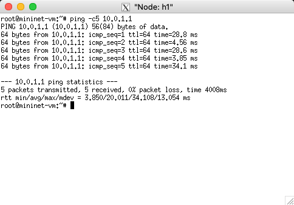
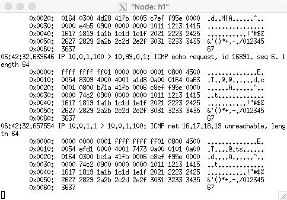

# OpenFlow Tutorial: Router Exercise

Copyright (c) 2020 Minaduki Shigure.  
南京大学 电子科学与工程学院 吴康正 171180571

## 实验环境

macOS "Catalina" 10.15.4  
VMware Funsion Pro Version 11.5.3 (15870345)  
Ubuntu 14.04.1 trusty w/ x86_64 Linux 4.2.0-27-generic  
mininet 2.2.2

## 实现方式

基于现有的POX代码加以修改，实现一个控制器，可以控制一个静态路由器完成给定的拓扑网络中的数据转发。

## 实验过程

### 使用自定义拓扑运行mininet

由于mininet不能自动生成比较复杂的拓扑，因此使用自定义的文件定义网络拓扑，同时预先配置各个节点的地址、子网和网关。

```py
from mininet.topo import Topo

class MyTopo( Topo ):

    def __init__( self ):
        "Create custom topo."

        # Initialize topology
        Topo.__init__( self )

        # Add hosts and switches
        Host_1 = self.addHost( 'h1', ip='10.0.1.100/24', defaultRoute='via 10.0.1.1' )
        Host_2 = self.addHost( 'h2', ip='10.0.2.100/24', defaultRoute='via 10.0.2.1' )
        Host_3 = self.addHost( 'h3', ip='10.0.3.100/24', defaultRoute='via 10.0.3.1' )
        centreSwitch = self.addSwitch( 's1' )


        # Add links
        self.addLink( Host_1, centreSwitch )
        self.addLink( Host_2, centreSwitch )
        self.addLink( Host_3, centreSwitch )


topos = { 'mytopo': ( lambda: MyTopo() ) }
```

然后使用自定义的拓扑运行mininet：

```bash
$ sudo mn --custom mytopo.py --topo mytopo --mac --controller remote
```

终端输出如下：

```plain
*** Creating network
*** Adding controller
Unable to contact the remote controller at 127.0.0.1:6653
Connecting to remote controller at 127.0.0.1:6633
*** Adding hosts:
h1 h2 h3 
*** Adding switches:
s1 
*** Adding links:
(h1, s1) (h2, s1) (h3, s1) 
*** Configuring hosts
h1 h2 h3 
*** Starting controller
c0 
*** Starting 1 switches
s1 ...
*** Starting CLI:
```

mininet成功创建了符合要求的拓扑，对节点输入ifconfig命令，可以看到节点配置正确：

```plain
mininet> h1 ifconfig
h1-eth0   Link encap:Ethernet  HWaddr 00:00:00:00:00:01  
          inet addr:10.0.1.100  Bcast:10.0.1.255  Mask:255.255.255.0
          UP BROADCAST RUNNING MULTICAST  MTU:1500  Metric:1
          RX packets:0 errors:0 dropped:0 overruns:0 frame:0
          TX packets:0 errors:0 dropped:0 overruns:0 carrier:0
          collisions:0 txqueuelen:1000 
          RX bytes:0 (0.0 B)  TX bytes:0 (0.0 B)

lo        Link encap:Local Loopback  
          inet addr:127.0.0.1  Mask:255.0.0.0
          UP LOOPBACK RUNNING  MTU:65536  Metric:1
          RX packets:0 errors:0 dropped:0 overruns:0 frame:0
          TX packets:0 errors:0 dropped:0 overruns:0 carrier:0
          collisions:0 txqueuelen:0 
          RX bytes:0 (0.0 B)  TX bytes:0 (0.0 B)
```

这样就完成了本实验mininet的配置。

### 控制器实现

控制器由POX文件`of_router.py`实现，该文件在上个实验`of_tutorial.py`的基础上修改实现。

**实际上，实验中的网络是完全静态的，因此本实验可以完全由对接口主机的判断和下发对应的预先准备的流表实现（就像斯坦福提供的solution一样），不过由于是在上一个实验的基础上修改而成的，因此本次实验的代码与solution的思路不同，有一定的学习能力，这样的好处是如果网络拓扑改变，本次实验的代码需要改动的部分会远小于solution需要改动的部分。**

由于代码篇幅较长，完整代码请在[Git Repo](https://git.nju.edu.cn/Minaduki/computer_networking/-/tree/master/openflow/src)中或者附件中查看。

对于输入的每一个帧，控制器整体的运行逻辑如下：

1. 收到包，判断是ARP帧，则转第2步，是IP数据报，则转第5步，否则不予理睬，转第10步。
2. 调用_handle_ARP函数处理。如果是ARP请求，转第3步，如果是ARP回应，转第4步，否则不予理睬，转第10步。
3. 如果请求的地址在ARP缓存中，则回应对应的地址，否则不予理睬。不论判断如何，转第10步。
4. 判断ARP回复的地址是否有在消息队列中等待转发的IP数据报，如果有则发送。不论判断如何，转第10步。
5. 调用_handle_IPv4函数处理。如果是发送给路由器的IP报，转第6步，否则转第7步。
6. 如果是ICMP echo request，调用_reply_ICMP函数回复处理，否则不予理睬。不论判断如何，转第10步。
7. 判断IP报可不可达，如果不可达，返回ICMP unreachable，转第10步，否则转第8步。
8. 查询ARP缓存是否有目标主机的硬件地址，如果没有，将IP报暂存在消息队列，并发送ARP请求，然后转第10步，否则转第9步。
9. 将IP报的硬件地址字段重写并发出，然后下发对应的流表项。转第10步。
10. 处理结束。

下面是部分关键代码。

#### 控制器存储

```py
# ARP cache
self.arp_cache = {}
# Init ARP record for router itself.
self.arp_cache['10.0.1.1'] = 'FF:FF:FF:FF:FF:01'
self.arp_cache['10.0.2.1'] = 'FF:FF:FF:FF:FF:02'
self.arp_cache['10.0.3.1'] = 'FF:FF:FF:FF:FF:03'
# Default MAC that mininet use for hosts starts from all zeros, 
# so we start ours from all ones.

# Routing table (create a structure with all of the information statically assigned)
self.routing_table = {}
self.routing_table['10.0.1.0/24'] = {'gateway_ip': '10.0.1.1', 'port': 1}
self.routing_table['10.0.2.0/24'] = {'gateway_ip': '10.0.2.1', 'port': 2}
self.routing_table['10.0.3.0/24'] = {'gateway_ip': '10.0.3.1', 'port': 3}

# Gateway IP to switch port
self.ip2port_dict = {}
self.ip2port_dict['10.0.1.1'] = 1
self.ip2port_dict['10.0.2.1'] = 2
self.ip2port_dict['10.0.3.1'] = 3

# Message queue (while the router waits for an ARP reply)
self.msg_queue = {}
```

控制器负责维护以下内容：

1. ARP缓存：记录每个IP拥有的硬件地址，初始化时拥有路由器自身的硬件地址信息。
2. 路由表：保存每个子网的网关IP和端口号。
3. 端口表：保存每个子网的网关IP对应的端口号。
4. 消息队列：暂存等待ARP回应的IP报。

*其中，mininet对于主机的硬件地址会从全0开始自动按顺序分配，对于交换机的硬件地址却是随机的（且与控制器ARP缓存预设的不一样），不过这并不会影响实际的网络功能，因此没有进行额外的配置。*  
*事实上，我一开始没有意识到主机的硬件地址是从全0开始的，因此我在ARP缓存中给路由器分配的硬件地址也是从全0开始的，直到观察下发流表的debug信息才发现并进行了改正，但是由于本题目中网络拓扑结构的原因，硬件地址冲突并不会影响到网络工作。*

#### 流表下发

```py
# Install new flow
log.debug("Installing flow...")
log.debug("Flow added: MATCH: nw_dst : %s" % dstip)
log.debug("Flow added: ACTION: set_src : %s" % self.arp_cache[self.routing_table[dstsubnet]['gateway_ip']])
log.debug("Flow added: ACTION: set_dst : %s" % self.arp_cache[dstip])
log.debug("Flow added: ACTION: output : #%d" % self.ip2port_dict[self.routing_table[dstsubnet]['gateway_ip']])

msg = of.ofp_flow_mod()
## Set fields to match received packet
msg.match.dl_type = ethernet.IP_TYPE
msg.match.nw_dst = ip_packet.dstip
          
#< Set other fields of flow_mod (timeouts? buffer_id?) >
msg.idle_timeout = 60
msg.hard_timeout = 600
msg.flags = 3

#< Add an output action, and send -- similar to resend_packet() >
msg.actions.append(of.ofp_action_dl_addr.set_src(self.arp_cache[self.routing_table[dstsubnet]['gateway_ip']]))
msg.actions.append(of.ofp_action_dl_addr.set_dst(self.arp_cache[dstip]))
msg.actions.append(of.ofp_action_output(port=self.ip2port_dict[self.routing_table[dstsubnet]['gateway_ip']]))

self.connection.send(msg)
log.debug("New flow configured.")
```

在控制器收到的IP包确定可以进行转发后，就会下发一条流表项，流表项会指示路由器将所有符合该目标IP的以太网帧的源硬件地址重写为路由器网关对应的硬件地址，目标硬件地址重写为目标IP对应的硬件地址，然后从对应的接口送出。

*写报告的时候又意识到，如果在收到ARP reply的时候也加入下发流表的代码，似乎可以提升性能。*

### 功能验证

在不同的终端窗口中分别启动POX控制器和mininet：

```bash
$ ./pox.py log.level --DEBUG misc.of_router
$ sudo mn --custom mytopo.py --topo mytopo --mac --controller remote
```

首先还是使用h1节点ping节点h2，控制器日志如下：

```plain
DEBUG:misc.of_router:Controlling [00-00-00-00-00-01 2]
DEBUG:misc.of_router:ARP frame received from port #1
DEBUG:misc.of_router:Updated MAC and port for ip 10.0.1.100 : Port #1, MAC: 00:00:00:00:00:01
DEBUG:misc.of_router:Handling ARP REQUEST frame:
DEBUG:misc.of_router:[ARP REQUEST hw:1 p:2048 00:00:00:00:00:01>00:00:00:00:00:00 10.0.1.100>10.0.1.1]
DEBUG:misc.of_router:Replying that FF:FF:FF:FF:FF:01 has 10.0.1.1
DEBUG:misc.of_router:ARP reply sent to port #1
DEBUG:misc.of_router:IPv4 diagram received from port #1
DEBUG:misc.of_router:IP diagram routable to subnet 10.0.2.0/24
DEBUG:misc.of_router:Trying to forward IP diagram to subnet 10.0.2.0/24 at port 2.
DEBUG:misc.of_router:The owner of 10.0.2.100 unknown. Flooding ARP request to port #2.
DEBUG:misc.of_router:ARP frame received from port #2
DEBUG:misc.of_router:Updated MAC and port for ip 10.0.2.100 : Port #2, MAC: 00:00:00:00:00:02
DEBUG:misc.of_router:Handling ARP REPLY frame:
DEBUG:misc.of_router:[ARP REPLY hw:1 p:2048 00:00:00:00:00:02>ff:ff:ff:ff:ff:02 10.0.2.100>10.0.2.1]
DEBUG:misc.of_router:ARP received: 00:00:00:00:00:02 has 10.0.2.100
DEBUG:misc.of_router:IPv4 diagram received from port #2
DEBUG:misc.of_router:IP diagram routable to subnet 10.0.1.0/24
DEBUG:misc.of_router:Trying to forward IP diagram to subnet 10.0.1.0/24 at port 1.
DEBUG:misc.of_router:IP diagram forwarded to 00:00:00:00:00:01.
DEBUG:misc.of_router:Installing flow...
DEBUG:misc.of_router:Flow added: MATCH: nw_dst : 10.0.1.100
DEBUG:misc.of_router:Flow added: ACTION: set_src : FF:FF:FF:FF:FF:01
DEBUG:misc.of_router:Flow added: ACTION: set_dst : 00:00:00:00:00:01
DEBUG:misc.of_router:Flow added: ACTION: output : #1
DEBUG:misc.of_router:New flow configured.
DEBUG:misc.of_router:IPv4 diagram received from port #1
DEBUG:misc.of_router:IP diagram routable to subnet 10.0.2.0/24
DEBUG:misc.of_router:Trying to forward IP diagram to subnet 10.0.2.0/24 at port 2.
DEBUG:misc.of_router:IP diagram forwarded to 00:00:00:00:00:02.
DEBUG:misc.of_router:Installing flow...
DEBUG:misc.of_router:Flow added: MATCH: nw_dst : 10.0.2.100
DEBUG:misc.of_router:Flow added: ACTION: set_src : FF:FF:FF:FF:FF:02
DEBUG:misc.of_router:Flow added: ACTION: set_dst : 00:00:00:00:00:02
DEBUG:misc.of_router:Flow added: ACTION: output : #2
DEBUG:misc.of_router:New flow configured.
DEBUG:misc.of_router:ARP frame received from port #2
DEBUG:misc.of_router:Handling ARP REQUEST frame:
DEBUG:misc.of_router:[ARP REQUEST hw:1 p:2048 00:00:00:00:00:02>00:00:00:00:00:00 10.0.2.100>10.0.2.1]
DEBUG:misc.of_router:Replying that FF:FF:FF:FF:FF:02 has 10.0.2.1
DEBUG:misc.of_router:ARP reply sent to port #2
```

日志中包含了整个从源主机发送ARP请求->路由器回应->源主机发送IP报给路由器->路由器发送ARP请求->路由器转发IP报给目标主机->控制器下发流表的过程，日志中，参数的配置均正确，同时，mininet终端显示也证明网络连通，可以认为路由器工作正常。

打开h1的终端，ping路由器的IP地址，控制器日志显示如下：

```plain
DEBUG:misc.of_router:ARP frame received from port #1
DEBUG:misc.of_router:Updated MAC and port for ip 10.0.1.100 : Port #1, MAC: 00:00:00:00:00:01
DEBUG:misc.of_router:Handling ARP REQUEST frame:
DEBUG:misc.of_router:[ARP REQUEST hw:1 p:2048 00:00:00:00:00:01>00:00:00:00:00:00 10.0.1.100>10.0.1.1]
DEBUG:misc.of_router:Replying that FF:FF:FF:FF:FF:01 has 10.0.1.1
DEBUG:misc.of_router:ARP reply sent to port #1
DEBUG:misc.of_router:IPv4 diagram received from port #1
DEBUG:misc.of_router:IP diagram routable to subnet 10.0.1.0/24
DEBUG:misc.of_router:ICMP echo request from 10.0.1.100
DEBUG:misc.of_router:ICMP echo reply sent to 10.0.1.100
DEBUG:misc.of_router:IPv4 diagram received from port #1
DEBUG:misc.of_router:IP diagram routable to subnet 10.0.1.0/24
DEBUG:misc.of_router:ICMP echo request from 10.0.1.100
DEBUG:misc.of_router:ICMP echo reply sent to 10.0.1.100
(省略)
```

同时h1终端显示ping的回应正常：



*理论而言，如何回应ICMP也可以作为流表项下发，不过因为不是常用的功能，对整体性能影响不大，因此没有实装。*

然后，使用h1节点ping不存在的10.99.0.1，控制器日志如下：

```plain
DEBUG:misc.of_router:IPv4 diagram received from port #1
DEBUG:misc.of_router:Destination 10.99.0.1 is unreachable. Replying with ICMP Unreachable.
```

同时h1接收到了返回的ICMP不可达的包：



最后，使用pingall命令进行整体测试：

```plain
*** Ping: testing ping reachability
h1 -> h2 h3 
h2 -> h1 h3 
h3 -> h1 h2 
*** Results: 0% dropped (6/6 received)
```

网络连通，工作正常。

使用iperf命令测试网络性能：

```plain
*** Iperf: testing TCP bandwidth between h1 and h3 
*** Results: ['26.1 Gbits/sec', '26.0 Gbits/sec']
```

网络性能符合预期，工作正常。

## 小结

通过此次实验，详细地理解了路由器的工作方式，加深了对OpenFlow流表的概念，同时对IP与以太网的工作方式有了初步的掌握。

## 附录：完整源码

```py
# Copyright 2012 James McCauley
#
# Licensed under the Apache License, Version 2.0 (the "License");
# you may not use this file except in compliance with the License.
# You may obtain a copy of the License at:
#
#     http://www.apache.org/licenses/LICENSE-2.0
#
# Unless required by applicable law or agreed to in writing, software
# distributed under the License is distributed on an "AS IS" BASIS,
# WITHOUT WARRANTIES OR CONDITIONS OF ANY KIND, either express or implied.
# See the License for the specific language governing permissions and
# limitations under the License.
#
# Modefied by Minaduki Shigure @ NJU, June 2020.
# Running the switch as a static router.
#

"""
This component is for use with the OpenFlow tutorial.

It acts as a simple hub, but can be modified to act like an L2
learning switch.

It's roughly similar to the one Brandon Heller did for NOX.
"""

from pox.core import core
import pox.openflow.libopenflow_01 as of
from netaddr import *
from pox.lib.revent import *
from pox.lib.packet.ethernet import ethernet
from pox.lib.packet.ipv4 import ipv4
from pox.lib.packet.arp import arp
from pox.lib.packet.icmp import icmp, echo
from pox.lib.packet.icmp import TYPE_ECHO_REQUEST, TYPE_ECHO_REPLY, TYPE_DEST_UNREACH, CODE_UNREACH_NET, CODE_UNREACH_HOST
from pox.lib.addresses import IPAddr, EthAddr
from pox.lib.util import str_to_bool, dpid_to_str


log = core.getLogger()


class Router (object):
  """
  A Router object is created for each switch that connects.
  A Connection object for that switch is passed to the __init__ function.
  """
  def __init__ (self, connection):
    # Keep track of the connection to the switch so that we can
    # send it messages!
    self.connection = connection

    # This binds our PacketIn event listener
    connection.addListeners(self)

    # Use this table to keep track of which ethernet address is on
    # which switch port (keys are MACs, values are ports).
    # self.mac_to_port = {}

    # ARP cache
    self.arp_cache = {}
    # Init ARP record for router itself.
    self.arp_cache['10.0.1.1'] = 'FF:FF:FF:FF:FF:01'
    self.arp_cache['10.0.2.1'] = 'FF:FF:FF:FF:FF:02'
    self.arp_cache['10.0.3.1'] = 'FF:FF:FF:FF:FF:03'
    # Default MAC that mininet use starts from all zeros, 
    # so we start ours from all ones.

    # Routing table (create a structure with all of the information statically assigned)
    self.routing_table = {}
    self.routing_table['10.0.1.0/24'] = {'gateway_ip': '10.0.1.1', 'port': 1}
    self.routing_table['10.0.2.0/24'] = {'gateway_ip': '10.0.2.1', 'port': 2}
    self.routing_table['10.0.3.0/24'] = {'gateway_ip': '10.0.3.1', 'port': 3}

    # Gateway IP to switch port
    self.ip2port_dict = {}
    self.ip2port_dict['10.0.1.1'] = 1
    self.ip2port_dict['10.0.2.1'] = 2
    self.ip2port_dict['10.0.3.1'] = 3

    # Message queue (while the router waits for an ARP reply)
    self.msg_queue = {}


  def resend_packet (self, packet_in, out_port):
    """
    Instructs the switch to resend a packet that it had sent to us.
    "packet_in" is the ofp_packet_in object the switch had sent to the
    controller due to a table-miss.
    """
    msg = of.ofp_packet_out()
    msg.data = packet_in

    # Add an action to send to the specified port
    action = of.ofp_action_output(port = out_port)
    msg.actions.append(action)

    # Send message to switch
    self.connection.send(msg)


  def _handle_ARP (self, packet, packet_in):
    """
    Handles ARP frame.
    """
    # Read ARP info.
    arp_body = packet.payload
    hwdst = arp_body.hwdst
    hwsrc = arp_body.hwsrc
    protodst = arp_body.protodst
    protosrc = arp_body.protosrc
    opcode = arp_body.opcode

    # The type of variables need to be converted.
    hwdst = str(hwdst)
    hwsrc = str(hwsrc)
    protodst = str(protodst)
    protosrc = str(protosrc)

    # New host here
    if protosrc not in self.arp_cache.keys():
      self.arp_cache[protosrc] = hwsrc
      # print(self.arp_cache)
      self.ip2port_dict[protosrc] = packet_in.in_port
      log.debug("Updated MAC and port for ip %s : Port #%d, MAC: %s" % (protosrc, packet_in.in_port, hwsrc))
      for subnet in self.routing_table.keys():
        if IPAddress(protodst) in IPNetwork(subnet):
          myhwaddr = self.arp_cache[self.routing_table[subnet]['gateway_ip']]
          break;
      
    if opcode == arp.REQUEST:
      log.debug("Handling ARP REQUEST frame:")
      log.debug(arp_body._to_str())

      if protodst in self.arp_cache.keys():
        log.debug("Replying that %s has %s" % (self.arp_cache[protodst], protodst))
        arp_reply = arp()
        arp_reply.opcode = arp.REPLY
        arp_reply.hwsrc = EthAddr(self.arp_cache[protodst])
        arp_reply.hwdst = arp_body.hwsrc
        arp_reply.protosrc = arp_body.protodst
        arp_reply.protodst = arp_body.protosrc

        ether = ethernet()
        ether.type = ether.ARP_TYPE
        ether.src = EthAddr(self.arp_cache[protodst])
        ether.dst = arp_body.hwsrc
        ether.payload = arp_reply

        self.resend_packet(ether, packet_in.in_port)
        log.debug("ARP reply sent to port #%d" % packet_in.in_port)

    elif opcode == arp.REPLY:
      log.debug("Handling ARP REPLY frame:")
      log.debug(arp_body._to_str())

      if protosrc in self.msg_queue.keys():
        log.debug("ARP received: %s has %s" % (hwsrc, protosrc))
        
        ether = ethernet()
        ether.type = ether.IP_TYPE
        ether.src = EthAddr(self.arp_cache[self.routing_table[self.msg_queue[protosrc]['dstsubnet']]['gateway_ip']])
        ether.dst = EthAddr(hwsrc)
        ether.payload = self.msg_queue[protosrc]['ip_packet']
        self.resend_packet(ether, packet_in.in_port)
        self.msg_queue.pop(protosrc)

    else:
      log.warning("Unsupported ARP opcode %d. Ignored." % opcode)


  def _reply_ICMP (self, packet, packet_in):
    """
    Replys ICMP packet.
    """
    ip_packet = packet.payload
    icmp_body = ip_packet.payload
    # log.debug()

    if icmp_body.type == TYPE_ECHO_REQUEST:
      log.debug("ICMP echo request from %s" % str(ip_packet.srcip))
      icmp_reply = icmp_body
      icmp_reply.type = TYPE_ECHO_REPLY

      ip_reply = ipv4()
      ip_reply.protocol = ipv4.ICMP_PROTOCOL
      ip_reply.srcip = ip_packet.dstip
      ip_reply.dstip = ip_packet.srcip
      ip_reply.payload = icmp_reply

      ether = ethernet()
      ether.type = ethernet.IP_TYPE
      ether.src = packet.dst
      ether.dst = packet.src
      ether.payload = ip_reply

      self.resend_packet(ether, packet_in.in_port)
      log.debug("ICMP echo reply sent to %s" % ip_reply.dstip)

    else:
      log.warning("I am not supposed to reply to ICMP type %d. Dropping." % icmp_body.type)
      

  def _handle_IPv4 (self, packet, packet_in):
    """
    Handles IPv4 diagram.
    """

    ip_packet = packet.payload # This is the packet payload.

    srcip = ip_packet.srcip
    dstip = ip_packet.dstip
    srcip = str(srcip)
    dstip = str(dstip)
    is_routable = False

    for subnet in self.routing_table:
      if IPAddress(dstip) in IPNetwork(subnet):
        is_routable = True
        dstsubnet = subnet
        log.debug("IP diagram routable to subnet %s" % dstsubnet)
        break

    if is_routable:
      if self.routing_table[dstsubnet]['gateway_ip'] == dstip:
        if ip_packet.protocol == ipv4.ICMP_PROTOCOL:
          self._reply_ICMP(packet, packet_in)
        else:
          log.warning("I am not supposed to reply to any IP diagrams. Dropping.")
      else:
        out_port = self.ip2port_dict[self.routing_table[dstsubnet]['gateway_ip']]
        log.debug("Trying to forward IP diagram to subnet %s at port %d." % (dstsubnet, out_port))
        if dstip not in self.arp_cache.keys():
          self.msg_queue[dstip] = {'dstsubnet': dstsubnet, 'ip_packet': ip_packet}
          log.debug("The owner of %s unknown. Flooding ARP request to port #%d." % (dstip, out_port))

          arp_body = arp()
          arp_body.opcode = arp.REQUEST
          arp_body.protosrc = IPAddr(self.routing_table[dstsubnet]['gateway_ip'])
          arp_body.protodst = ip_packet.dstip
          arp_body.hwsrc = EthAddr(self.arp_cache[self.routing_table[dstsubnet]['gateway_ip']])
          arp_body.hwdst = EthAddr('FF:FF:FF:FF:FF:FF')

          ether = ethernet()
          ether.type = ethernet.ARP_TYPE
          ether.src = EthAddr(self.arp_cache[self.routing_table[dstsubnet]['gateway_ip']])
          ether.dst = EthAddr('FF:FF:FF:FF:FF:FF')
          ether.payload = arp_body

          self.resend_packet(ether, out_port)

        else:
          fwd = packet
          fwd.src = EthAddr(self.arp_cache[self.routing_table[dstsubnet]['gateway_ip']])
          fwd.dst = EthAddr(self.arp_cache[dstip])
          self.resend_packet(fwd, out_port)
          log.debug("IP diagram forwarded to %s." % fwd.dst)

          # Install new flow
          log.debug("Installing flow...")
          log.debug("Flow added: MATCH: nw_dst : %s" % dstip)
          log.debug("Flow added: ACTION: set_src : %s" % self.arp_cache[self.routing_table[dstsubnet]['gateway_ip']])
          log.debug("Flow added: ACTION: set_dst : %s" % self.arp_cache[dstip])
          log.debug("Flow added: ACTION: output : #%d" % self.ip2port_dict[self.routing_table[dstsubnet]['gateway_ip']])

          msg = of.ofp_flow_mod()
          ## Set fields to match received packet
          msg.match.dl_type = ethernet.IP_TYPE
          msg.match.nw_dst = ip_packet.dstip
          
          #< Set other fields of flow_mod (timeouts? buffer_id?) >
          msg.idle_timeout = 60
          msg.hard_timeout = 600
          msg.flags = 3

          #< Add an output action, and send -- similar to resend_packet() >
          msg.actions.append(of.ofp_action_dl_addr.set_src(self.arp_cache[self.routing_table[dstsubnet]['gateway_ip']]))
          msg.actions.append(of.ofp_action_dl_addr.set_dst(self.arp_cache[dstip]))
          msg.actions.append(of.ofp_action_output(port=self.ip2port_dict[self.routing_table[dstsubnet]['gateway_ip']]))

          self.connection.send(msg)
          log.debug("New flow configured.")

    else:
      log.debug("Destination %s is unreachable. Replying with ICMP Unreachable." % dstip)
      
      for subnet in self.routing_table:
        if IPAddress(srcip) in IPNetwork(subnet):
          srcsubnet = subnet
          break

      icmp_reply = icmp()
      icmp_reply.type = TYPE_DEST_UNREACH
      icmp_reply.code = CODE_UNREACH_NET
      icmp_reply.payload = ip_packet.payload.payload

      ip_reply = ipv4()
      ip_reply.protocol = ipv4.ICMP_PROTOCOL
      ip_reply.srcip = IPAddr(self.routing_table[srcsubnet]['gateway_ip'])
      ip_reply.dstip = ip_packet.srcip
      ip_reply.payload = icmp_reply

      ether = ethernet()
      ether.type = ethernet.IP_TYPE
      ether.src = packet.dst
      ether.dst = packet.src
      ether.payload = ip_reply

      self.resend_packet(ether, packet_in.in_port)


  def act_like_router (self, packet, packet_in):
    """
    Implement router-like behavior.
    """

    # Learn the port for the source MAC
    # self.mac_to_port[packet.src] = packet_in.in_port
    # log.debug("Updated MAC for port %d : %s" % (packet_in.in_port, packet.src))

    if packet.type == ethernet.ARP_TYPE:
      log.debug("ARP frame received from port #%d" % packet_in.in_port)
      self._handle_ARP(packet, packet_in)
    elif packet.type == ethernet.IP_TYPE:
      log.debug("IPv4 diagram received from port #%d" % packet_in.in_port)
      self._handle_IPv4(packet, packet_in)
    else:
      log.warning("Unsupported frame received from port #%d. Dropping." % packet_in.in_port)


  def _handle_PacketIn (self, event):
    """
    Handles packet in messages from the switch.
    """
    packet = event.parsed # This is the parsed packet data.
    if not packet.parsed:
      log.warning("Ignoring incomplete packet")
      return

    packet_in = event.ofp # The actual ofp_packet_in message.

    # Comment out the following line and uncomment the one after
    # when starting the exercise.
    self.act_like_router(packet, packet_in)


def launch ():
  """
  Starts the component
  """
  def start_switch (event):
    log.debug("Controlling %s" % (event.connection,))
    Router(event.connection)
  core.openflow.addListenerByName("ConnectionUp", start_switch)
```