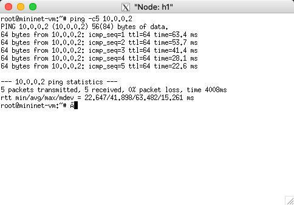
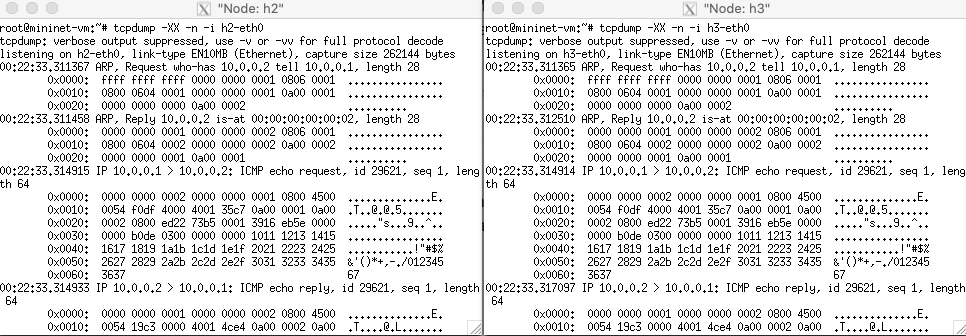
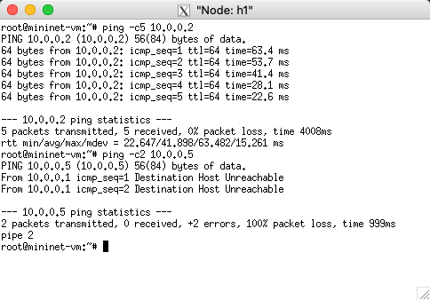
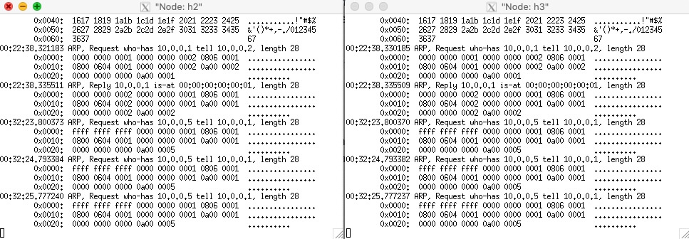
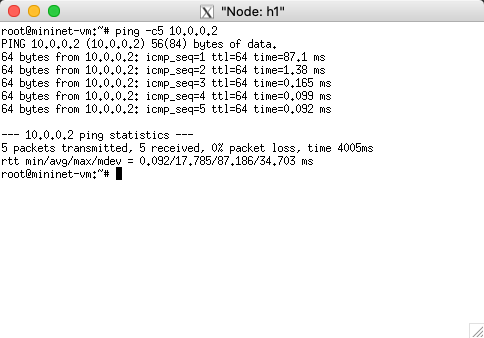
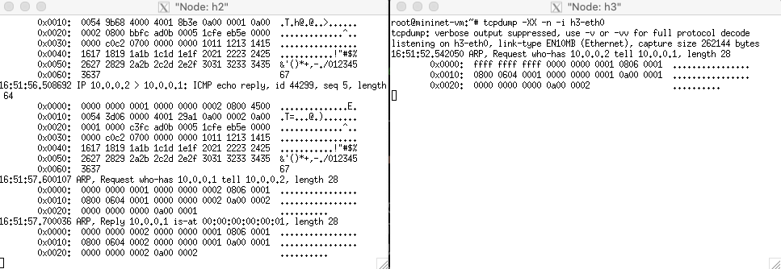

# OpenFlow Tutorial: Create a Learning Switch

Copyright (c) 2020 Minaduki Shigure.  
南京大学 电子科学与工程学院 吴康正 171180571

## 实验环境

macOS "Catalina" 10.15.4  
VMware Funsion Pro Version 11.5.3 (15870345)  
Ubuntu 14.04.1 trusty w/ x86_64 Linux 4.2.0-27-generic  
mininet 2.2.2

## 实现方式

基于现有的POX代码加以修改，实现一个控制器，可以控制多个交换机实现自学习的转发。

## 实验过程

### 节点作为集线器接入

首先，在不对POX代码进行任何修改的情况下，使用如下命令直接运行POX程序：

```bash
$ ./pox.py log.level --DEBUG misc.of_tutorial
```

程序输出如下：

```plain
POX 0.2.0 (carp) / Copyright 2011-2013 James McCauley, et al.
DEBUG:core:POX 0.2.0 (carp) going up...
DEBUG:core:Running on CPython (2.7.6/Oct 26 2016 20:30:19)
DEBUG:core:Platform is Linux-4.2.0-27-generic-x86_64-with-Ubuntu-14.04-trusty
INFO:core:POX 0.2.0 (carp) is up.
DEBUG:openflow.of_01:Listening on 0.0.0.0:6633
```

可以看到，POX控制器正在监听6633端口的通信，等待交换机节点连接。

然后，运行mininet，创建一个有3个主机连接到同一个交换机节点的拓扑：

```bash
$ sudo mn --topo single,3 --mac --switch ovsk --controller remote
```

mininet的部分输出如下：

```plain
*** Adding controller
Unable to contact the remote controller at 127.0.0.1:6653
Connecting to remote controller at 127.0.0.1:6633
```

这证明mininet中的节点已经连接到了使用POX程序创建的控制器上，同时在POX程序的输出中也可以看到有一个新的节点连入：

```plain
INFO:openflow.of_01:[00-00-00-00-00-01 2] connected
DEBUG:misc.of_tutorial:Controlling [00-00-00-00-00-01 2]
```

这样就完成了整个网络拓扑的配置，根据POX文件中的内容，交换机节点此时表现为集线器，也就是说控制器会指挥节点将收到的包泛洪到节点其他的所有接口。  
以上的配置命令和输出除非有所变化，否则在后续实验中将不再重复。

在mininet中，启动各个节点的终端，在h2和h3节点中，运行tcpdump命令监控输入的封包，在h1节点中，使用ping命令发送ICMP封包给h2节点：

```plain
h2 # tcpdump -XX -n -i h2-eth0
h3 # tcpdump -XX -n -i h3-eth0
h1 # ping 10.0.0.2
```

对于h1节点的反馈，可以看见h1节点与h2节点之间可以ping通，平均RTT约为41ms。


对于h2、h3节点的反馈，可以看见两个节点收到了完全一样的封包，包括ARP请求、h1发送的ICMP包和h2回复的ICMP包。


接下来，尝试使用h1节点ping一个不存在的节点`10.0.0.5`，结果如下：

h1节点无法连通目标节点。


h2、h3节点收到了h1节点发出的ARP请求，但是由于没有回应，因此没有后续的ICMP包发出，也自然没有捕获。


另外，还可以在mininet终端中直接输入pingall命令检测所有节点之间的连通性，由于与单独ping结果一样，因此不另行展示。

使用iperf命令可以测试节点之间的网络性能，在mininet终端内输入iperf，mininet会测试在h1节点和h3节点之间的网络性能，测试结果如下：

```plain
*** Iperf: testing TCP bandwidth between h1 and h3 
*** Results: ['12.3 Mbits/sec', '14.7 Mbits/sec']
```

tcpdump的结果与ping相同，h2与h3都收到了完全相同的封包。

按照ovs-ofctl的输出显示，节点之间的链路应至少为10Gbps的链路，然而iperf测试得到的网络连接速度很缓慢，同时在POX的日志中提示队列中排队的封包过多，推测应该是由于每个封包都会发送给控制器，然后再由控制器下令进行泛洪的原因导致的，这也能够解释在ping的时候RTT为什么一直反常地较高。

**另外需要指出的一点是，tcpdump本身对网络性能有负面影响，如果tcpdump在运行则iperf测试的结果会偏低，关闭tcpdump后，集线器模式的性能测试结果为['19.9 Mbits/sec', '23.0 Mbits/sec']，略强于tcpdump运行时的性能，而这个性能差距在交换机模式下更加明显。**

### 节点作为交换机接入

修改文件`of_tutorial.py`，在Tutorial类中加入函数act_like_switch，内容如下：

```py
def act_like_switch (self, packet, packet_in):
    """
    Implement switch-like behavior.
    """

    # Here's some psuedocode to start you off implementing a learning
    # switch.  You'll need to rewrite it as real Python code.

    # Learn the port for the source MAC
    self.mac_to_port[packet.src] = packet_in.in_port
    log.debug("Updated MAC for port %d : %s" % (packet_in.in_port, packet.src))

    if packet.dst in self.mac_to_port:
        # Send packet out the associated port
        self.resend_packet(packet_in, self.mac_to_port[packet.dst])
        log.debug("MAC matched, sending to port %d" % self.mac_to_port[packet.dst])

        # Once you have the above working, try pushing a flow entry
        # instead of resending the packet (comment out the above and
        # uncomment and complete the below.)

        log.debug("Installing flow...")
        # Maybe the log statement should have source/destination/port?
        log.debug("Flow added: MATCH: in_port :  %s" % packet_in.in_port)
        log.debug("Flow added: MATCH: MAC_src :  %s" % packet.src)
        log.debug("Flow added: MATCH: MAC_dst :  %s" % packet.dst)
        log.debug("Flow added: ACTION: out_port :  %s" % self.mac_to_port[packet.dst])

        msg = of.ofp_flow_mod()
        #
        ## Set fields to match received packet
        msg.match = of.ofp_match.from_packet(packet)
      
        #< Set other fields of flow_mod (timeouts? buffer_id?) >
        msg.idle_timeout = 60
        msg.hard_timeout = 600
        """ It seems the buffer is not avaliable? Buffer ID will not be sent.
        if packet_in.buffer_id != -1 and packet_in.buffer_id is not None:
            # We got a buffer ID from the switch; use that
            msg.buffer_id = packet_in.buffer_id
            log.debug("buffer_id : %s" % packet_in.buffer_id)
        """

        #< Add an output action, and send -- similar to resend_packet() >
        msg.actions.append(of.ofp_action_output(port=self.mac_to_port[packet.dst]))

        self.connection.send(msg)
        log.debug("New flow configured.")

    else:
        # Flood the packet out everything but the input port
        # This part looks familiar, right?
        self.resend_packet(packet_in, of.OFPP_ALL)
        log.debug("Port for MAC %s unknown. Flooding." % packet.dst)
```

函数的具体实现思路是：当一个封包被发送到控制器时，控制器首先将封包来源的端口和MAC地址记录到字典中，然后判断封包目的地的MAC地址是否在字典中，如果不在，则泛洪，否则会命令交换机将封包送到对应的端口，同时下发一条新的流到交换机，流的内容即为在对应的输入端口、源MAC和目标MAC的情况下，使用哪个端口发送的指令，这样在流过期之前，交换机就可以不依赖控制器完成转发。

然后修改函数_handle_PacketIn中的内容，将act_like_hub修改为act_like_switch，这样控制器就会调用act_like_switch函数的内容，实现交换机的功能配置。

启动POX控制器和mininet，首先还是使用h1节点ping节点h2，控制器日志如下：

```plain
DEBUG:misc.of_tutorial:Updated MAC for port 1 : 00:00:00:00:00:01
DEBUG:misc.of_tutorial:Port for MAC ff:ff:ff:ff:ff:ff unknown. Flooding.
DEBUG:misc.of_tutorial:Updated MAC for port 2 : 00:00:00:00:00:02
DEBUG:misc.of_tutorial:MAC matched, sending to port 1
DEBUG:misc.of_tutorial:Installing flow...
DEBUG:misc.of_tutorial:Flow added: MATCH: in_port :  2
DEBUG:misc.of_tutorial:Flow added: MATCH: MAC_src :  00:00:00:00:00:02
DEBUG:misc.of_tutorial:Flow added: MATCH: MAC_dst :  00:00:00:00:00:01
DEBUG:misc.of_tutorial:Flow added: ACTION: out_port :  1
DEBUG:misc.of_tutorial:New flow configured.
DEBUG:misc.of_tutorial:Updated MAC for port 1 : 00:00:00:00:00:01
DEBUG:misc.of_tutorial:MAC matched, sending to port 2
DEBUG:misc.of_tutorial:Installing flow...
DEBUG:misc.of_tutorial:Flow added: MATCH: in_port :  1
DEBUG:misc.of_tutorial:Flow added: MATCH: MAC_src :  00:00:00:00:00:01
DEBUG:misc.of_tutorial:Flow added: MATCH: MAC_dst :  00:00:00:00:00:02
DEBUG:misc.of_tutorial:Flow added: ACTION: out_port :  2
DEBUG:misc.of_tutorial:New flow configured.
```

控制器根据节点上交的封包信息自动“学习”了端口对应的MAC地址，同时也根据学习的MAC地址完成了流的下发，这样对于后续的同样封包，交换机节点就可以自行处理。

在h1节点的终端处可见，第一个封包的RTT很长，这是因为交换机中没有配置好的流，因此需要把包发送给控制器进行判断，而后续封包的RTT急剧下降，就是因为控制器下发了流之后，交换机不再需要与控制器通讯就可以完成转发，因此转发的时间降低了。


同时在h2与h3节点中也可以看到，h2节点收到了所有有关的封包，而h3节点只收到了一开始泛洪的一个ARP包。


使用iperf命令测试网络性能，性能相比集线器模式下有巨大的提升，同时tcpdump也显示，所有的数据均被发送到了h3节点，h2节点仅收到了一些ARP包，这里不再赘述。

```plain
*** Iperf: testing TCP bandwidth between h1 and h3 
*** Results: ['10.5 Gbits/sec', '10.5 Gbits/sec']
```

之前提到，tcpdump会影响网络性能，关闭tcpdump后，iperf测试结果有所提升：

```plain
*** Iperf: testing TCP bandwidth between h1 and h3 
*** Results: ['29.1 Gbits/sec', '29.1 Gbits/sec']
```

### 多节点支持

使用mininet建立一个有两个交换机和两个终端的拓扑。

```bash
$ sudo mn --topo linear --switch ovsk --controller remote
```

由于POX会为每个接入的交换机分别创建一个控制器实例，因此POX的代码不需要修改，可以在POX日志中看见有两个交换机接入：

```plain
INFO:openflow.of_01:[00-00-00-00-00-02 2] connected
DEBUG:misc.of_tutorial:Controlling [00-00-00-00-00-02 2]
INFO:openflow.of_01:[00-00-00-00-00-01 3] connected
DEBUG:misc.of_tutorial:Controlling [00-00-00-00-00-01 3]
```

使用mininet终端的`pingall`命令测试，两台主机之间网络畅通，同时也可以看见POX日志中进行了学习和流的下发。不过POX日志中没有对不同的交换机进行区分，因此看起来比较混乱。

```plain
DEBUG:misc.of_tutorial:Updated MAC for port 1 : be:05:6d:09:e4:1a
DEBUG:misc.of_tutorial:Port for MAC ff:ff:ff:ff:ff:ff unknown. Flooding.
DEBUG:misc.of_tutorial:Updated MAC for port 2 : be:05:6d:09:e4:1a
DEBUG:misc.of_tutorial:Port for MAC ff:ff:ff:ff:ff:ff unknown. Flooding.
DEBUG:misc.of_tutorial:Updated MAC for port 1 : 5e:fa:45:b1:5e:f0
DEBUG:misc.of_tutorial:MAC matched, sending to port 2
DEBUG:misc.of_tutorial:Installing flow...
DEBUG:misc.of_tutorial:Flow added: MATCH: in_port :  1
DEBUG:misc.of_tutorial:Flow added: MATCH: MAC_src :  5e:fa:45:b1:5e:f0
DEBUG:misc.of_tutorial:Flow added: MATCH: MAC_dst :  be:05:6d:09:e4:1a
DEBUG:misc.of_tutorial:Flow added: ACTION: out_port :  2
DEBUG:misc.of_tutorial:New flow configured.
DEBUG:misc.of_tutorial:Updated MAC for port 2 : 5e:fa:45:b1:5e:f0
DEBUG:misc.of_tutorial:MAC matched, sending to port 1
DEBUG:misc.of_tutorial:Installing flow...
DEBUG:misc.of_tutorial:Flow added: MATCH: in_port :  2
DEBUG:misc.of_tutorial:Flow added: MATCH: MAC_src :  5e:fa:45:b1:5e:f0
DEBUG:misc.of_tutorial:Flow added: MATCH: MAC_dst :  be:05:6d:09:e4:1a
DEBUG:misc.of_tutorial:Flow added: ACTION: out_port :  1
DEBUG:misc.of_tutorial:New flow configured.
DEBUG:misc.of_tutorial:Updated MAC for port 1 : be:05:6d:09:e4:1a
DEBUG:misc.of_tutorial:MAC matched, sending to port 2
DEBUG:misc.of_tutorial:Installing flow...
DEBUG:misc.of_tutorial:Flow added: MATCH: in_port :  1
DEBUG:misc.of_tutorial:Flow added: MATCH: MAC_src :  be:05:6d:09:e4:1a
DEBUG:misc.of_tutorial:Flow added: MATCH: MAC_dst :  5e:fa:45:b1:5e:f0
DEBUG:misc.of_tutorial:Flow added: ACTION: out_port :  2
DEBUG:misc.of_tutorial:New flow configured.
DEBUG:misc.of_tutorial:Updated MAC for port 2 : be:05:6d:09:e4:1a
DEBUG:misc.of_tutorial:MAC matched, sending to port 1
DEBUG:misc.of_tutorial:Installing flow...
DEBUG:misc.of_tutorial:Flow added: MATCH: in_port :  2
DEBUG:misc.of_tutorial:Flow added: MATCH: MAC_src :  be:05:6d:09:e4:1a
DEBUG:misc.of_tutorial:Flow added: MATCH: MAC_dst :  5e:fa:45:b1:5e:f0
DEBUG:misc.of_tutorial:Flow added: ACTION: out_port :  1
DEBUG:misc.of_tutorial:New flow configured.
DEBUG:misc.of_tutorial:Updated MAC for port 1 : 5e:fa:45:b1:5e:f0
DEBUG:misc.of_tutorial:MAC matched, sending to port 2
DEBUG:misc.of_tutorial:Installing flow...
DEBUG:misc.of_tutorial:Flow added: MATCH: in_port :  1
DEBUG:misc.of_tutorial:Flow added: MATCH: MAC_src :  5e:fa:45:b1:5e:f0
DEBUG:misc.of_tutorial:Flow added: MATCH: MAC_dst :  be:05:6d:09:e4:1a
DEBUG:misc.of_tutorial:Flow added: ACTION: out_port :  2
DEBUG:misc.of_tutorial:New flow configured.
DEBUG:misc.of_tutorial:Updated MAC for port 2 : 5e:fa:45:b1:5e:f0
DEBUG:misc.of_tutorial:MAC matched, sending to port 1
DEBUG:misc.of_tutorial:Installing flow...
DEBUG:misc.of_tutorial:Flow added: MATCH: in_port :  2
DEBUG:misc.of_tutorial:Flow added: MATCH: MAC_src :  5e:fa:45:b1:5e:f0
DEBUG:misc.of_tutorial:Flow added: MATCH: MAC_dst :  be:05:6d:09:e4:1a
DEBUG:misc.of_tutorial:Flow added: ACTION: out_port :  1
DEBUG:misc.of_tutorial:New flow configured.
DEBUG:misc.of_tutorial:Updated MAC for port 1 : 5e:fa:45:b1:5e:f0
DEBUG:misc.of_tutorial:MAC matched, sending to port 2
DEBUG:misc.of_tutorial:Installing flow...
DEBUG:misc.of_tutorial:Flow added: MATCH: in_port :  1
DEBUG:misc.of_tutorial:Flow added: MATCH: MAC_src :  5e:fa:45:b1:5e:f0
DEBUG:misc.of_tutorial:Flow added: MATCH: MAC_dst :  be:05:6d:09:e4:1a
DEBUG:misc.of_tutorial:Flow added: ACTION: out_port :  2
DEBUG:misc.of_tutorial:New flow configured.
DEBUG:misc.of_tutorial:Updated MAC for port 2 : 5e:fa:45:b1:5e:f0
DEBUG:misc.of_tutorial:MAC matched, sending to port 1
DEBUG:misc.of_tutorial:Installing flow...
DEBUG:misc.of_tutorial:Flow added: MATCH: in_port :  2
DEBUG:misc.of_tutorial:Flow added: MATCH: MAC_src :  5e:fa:45:b1:5e:f0
DEBUG:misc.of_tutorial:Flow added: MATCH: MAC_dst :  be:05:6d:09:e4:1a
DEBUG:misc.of_tutorial:Flow added: ACTION: out_port :  1
DEBUG:misc.of_tutorial:New flow configured.
DEBUG:misc.of_tutorial:Updated MAC for port 1 : be:05:6d:09:e4:1a
DEBUG:misc.of_tutorial:MAC matched, sending to port 2
DEBUG:misc.of_tutorial:Installing flow...
DEBUG:misc.of_tutorial:Flow added: MATCH: in_port :  1
DEBUG:misc.of_tutorial:Flow added: MATCH: MAC_src :  be:05:6d:09:e4:1a
DEBUG:misc.of_tutorial:Flow added: MATCH: MAC_dst :  5e:fa:45:b1:5e:f0
DEBUG:misc.of_tutorial:Flow added: ACTION: out_port :  2
DEBUG:misc.of_tutorial:New flow configured.
DEBUG:misc.of_tutorial:Updated MAC for port 2 : be:05:6d:09:e4:1a
DEBUG:misc.of_tutorial:MAC matched, sending to port 1
DEBUG:misc.of_tutorial:Installing flow...
DEBUG:misc.of_tutorial:Flow added: MATCH: in_port :  2
DEBUG:misc.of_tutorial:Flow added: MATCH: MAC_src :  be:05:6d:09:e4:1a
DEBUG:misc.of_tutorial:Flow added: MATCH: MAC_dst :  5e:fa:45:b1:5e:f0
DEBUG:misc.of_tutorial:Flow added: ACTION: out_port :  1
DEBUG:misc.of_tutorial:New flow configured.
DEBUG:misc.of_tutorial:Updated MAC for port 1 : 5e:fa:45:b1:5e:f0
DEBUG:misc.of_tutorial:MAC matched, sending to port 2
DEBUG:misc.of_tutorial:Installing flow...
DEBUG:misc.of_tutorial:Flow added: MATCH: in_port :  1
DEBUG:misc.of_tutorial:Flow added: MATCH: MAC_src :  5e:fa:45:b1:5e:f0
DEBUG:misc.of_tutorial:Flow added: MATCH: MAC_dst :  be:05:6d:09:e4:1a
DEBUG:misc.of_tutorial:Flow added: ACTION: out_port :  2
DEBUG:misc.of_tutorial:New flow configured.
DEBUG:misc.of_tutorial:Updated MAC for port 2 : 5e:fa:45:b1:5e:f0
DEBUG:misc.of_tutorial:MAC matched, sending to port 1
DEBUG:misc.of_tutorial:Installing flow...
DEBUG:misc.of_tutorial:Flow added: MATCH: in_port :  2
DEBUG:misc.of_tutorial:Flow added: MATCH: MAC_src :  5e:fa:45:b1:5e:f0
DEBUG:misc.of_tutorial:Flow added: MATCH: MAC_dst :  be:05:6d:09:e4:1a
DEBUG:misc.of_tutorial:Flow added: ACTION: out_port :  1
DEBUG:misc.of_tutorial:New flow configured.
DEBUG:misc.of_tutorial:Updated MAC for port 1 : be:05:6d:09:e4:1a
DEBUG:misc.of_tutorial:MAC matched, sending to port 2
DEBUG:misc.of_tutorial:Installing flow...
DEBUG:misc.of_tutorial:Flow added: MATCH: in_port :  1
DEBUG:misc.of_tutorial:Flow added: MATCH: MAC_src :  be:05:6d:09:e4:1a
DEBUG:misc.of_tutorial:Flow added: MATCH: MAC_dst :  5e:fa:45:b1:5e:f0
DEBUG:misc.of_tutorial:Flow added: ACTION: out_port :  2
DEBUG:misc.of_tutorial:New flow configured.
DEBUG:misc.of_tutorial:Updated MAC for port 2 : be:05:6d:09:e4:1a
DEBUG:misc.of_tutorial:MAC matched, sending to port 1
DEBUG:misc.of_tutorial:Installing flow...
DEBUG:misc.of_tutorial:Flow added: MATCH: in_port :  2
DEBUG:misc.of_tutorial:Flow added: MATCH: MAC_src :  be:05:6d:09:e4:1a
DEBUG:misc.of_tutorial:Flow added: MATCH: MAC_dst :  5e:fa:45:b1:5e:f0
DEBUG:misc.of_tutorial:Flow added: ACTION: out_port :  1
DEBUG:misc.of_tutorial:New flow configured.
```

最后，使用iperf测试一下网络性能：

```plain
*** Iperf: testing TCP bandwidth between h1 and h2 
*** Results: ['27.4 Gbits/sec', '27.4 Gbits/sec']
```

网络性能符合预期。

## 小结

通过此次实验，对OpenFlow的基本概念有了详细的理解，同时对自学习交换机的工作原理有了直观的认识，同时也初步掌握了一些工具比如mininet和X11转发的使用方法。