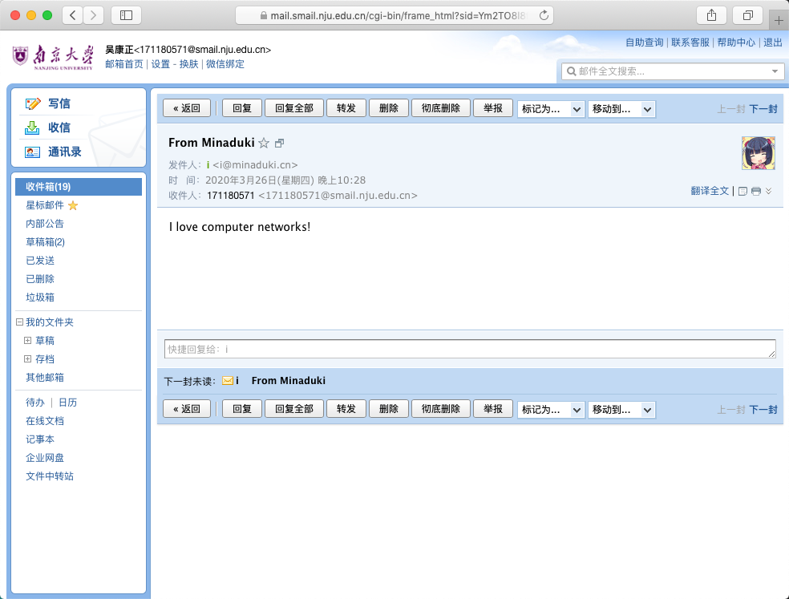

# Wireshark Lab: HTTP

Copyright (c) 2020 Minaduki Shigure.  
南京大学 电子科学与工程学院 吴康正 171180571

## 实验环境

macOS “Mojave” 10.14.5  
Broadcom BCM4352 Wireless Network Adapter  
Wireshark Version 3.2.2 (v3.2.2-0-ga3efece3d640)  
Safari Version 12.1.1 (14607.2.6.1.1)


```
Minadukis-MacBook-Pro:3_SMTPClient minaduki$ python3 client.py 
220 smtp.qq.com Esmtp QQ Mail Server

250 smtp.qq.com

334 VXNlcm5hbWU6

334 UGFzc3dvcmQ6

235 Authentication successful

250 Ok

250 Ok

354 End data with <CR><LF>.<CR><LF>

250 Ok: queued as 

221 Bye

```
