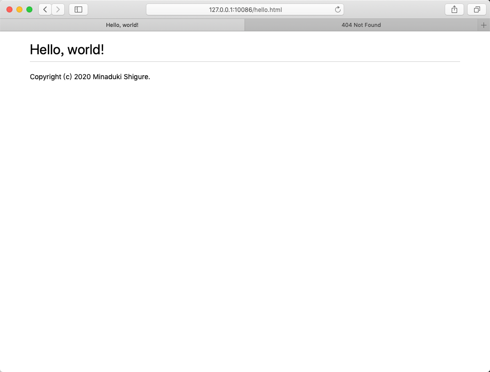
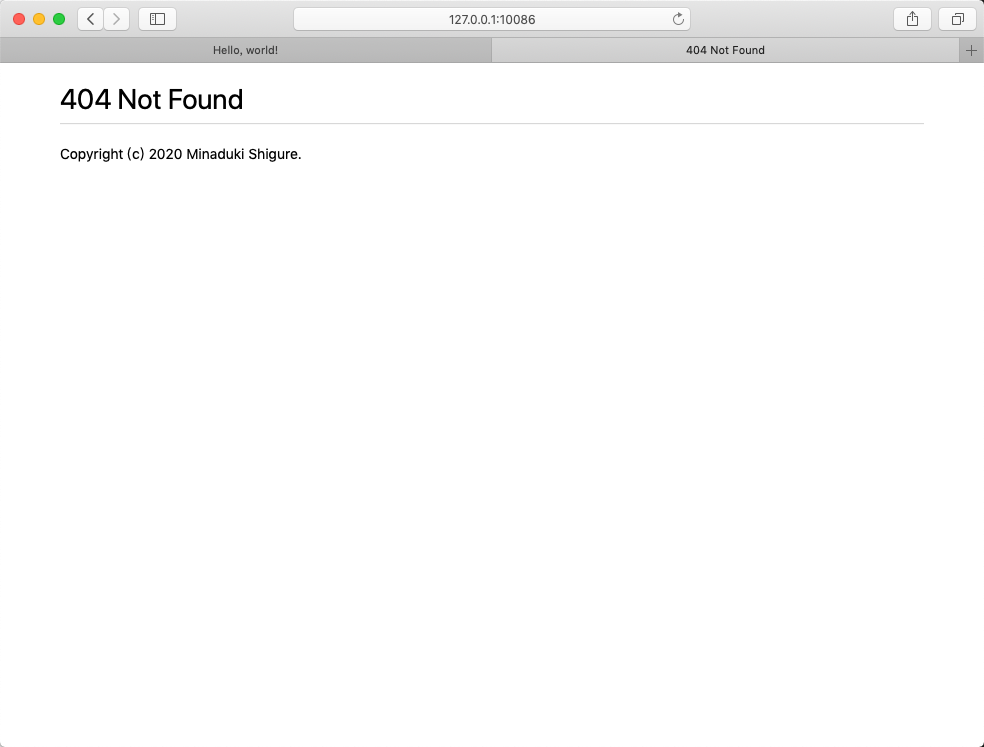

# Socket Programming: Webserver

Copyright (c) 2020 Minaduki Shigure.  
南京大学 电子科学与工程学院 吴康正 171180571

## 实验环境

macOS “Mojave” 10.14.5  
Broadcom BCM4352 Wireless Network Adapter  
Wireshark Version 3.2.2 (v3.2.2-0-ga3efece3d640)  
Safari Version 12.1.1 (14607.2.6.1.1)

## 实验结果

1. 使用socket实现了一个HTTP服务器，可以识别浏览器的HTTP GET请求，并且返回对应的网页页面，如果没有对应的页面，则会返回404 Not Found，并且给出一个对应的提示页面。  
  

2. 由于前面已经使用了socket编程，对于拓展要求，选用了Python自带的HTTP库，实现了HTTP访问，并下载对应的页面，以client为前缀保存。

```plain
Minadukis-MacBook-Pro:1_WebServer minaduki$ python3 client.py 127.0.0.1 10086 hello.html
200 OK
Connection: close
Content-Type: text/html
Content-Length: 970
```

同时保存了client-hello.html文件

## 小结

您也可以访问http://schwi-dola.com:10086/hello.html查看实验成果