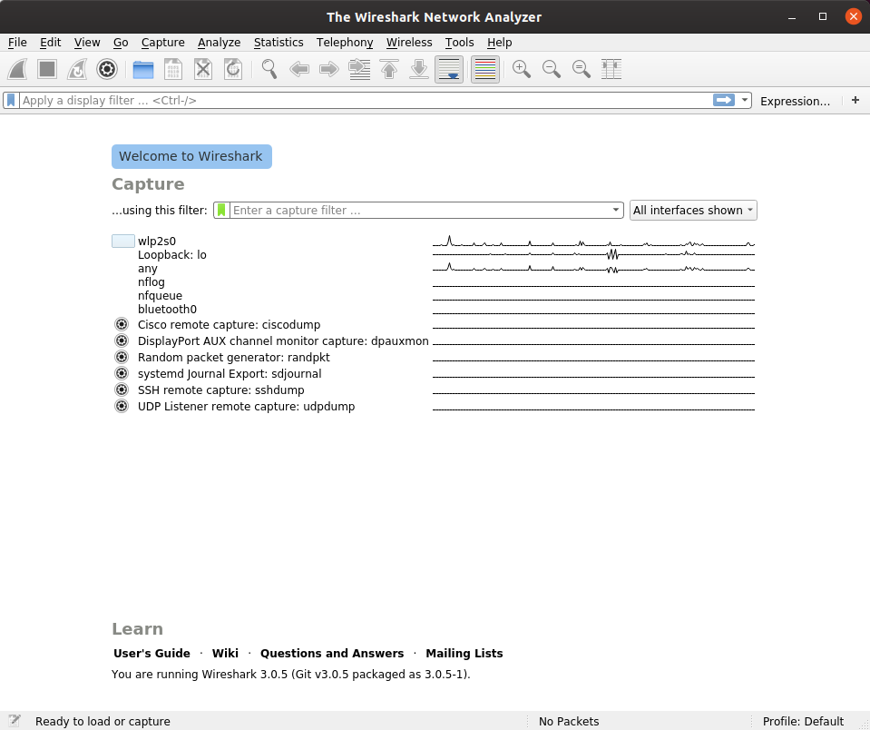
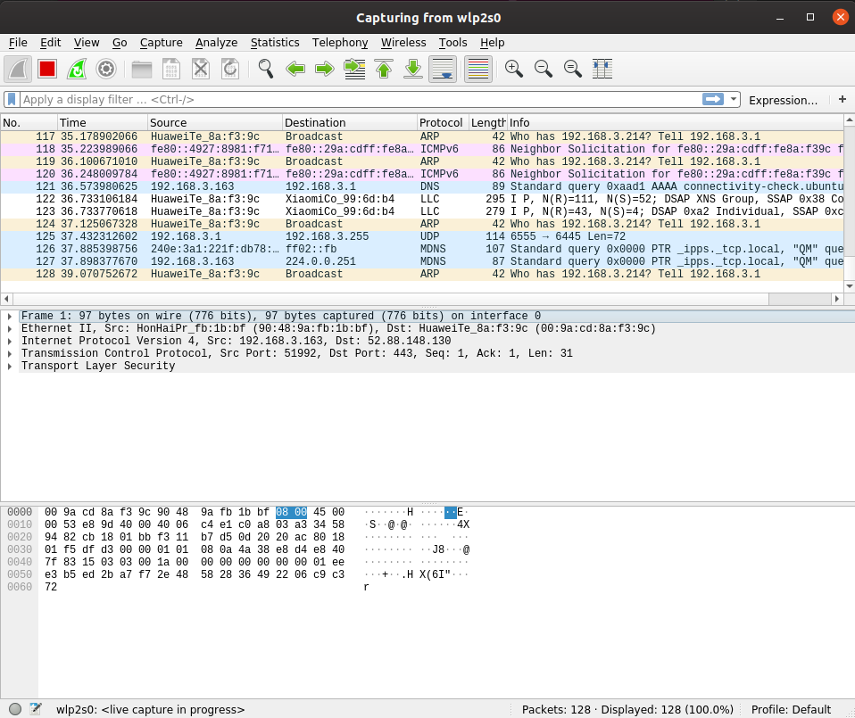
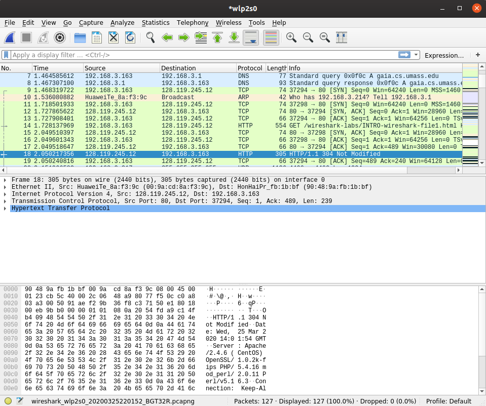
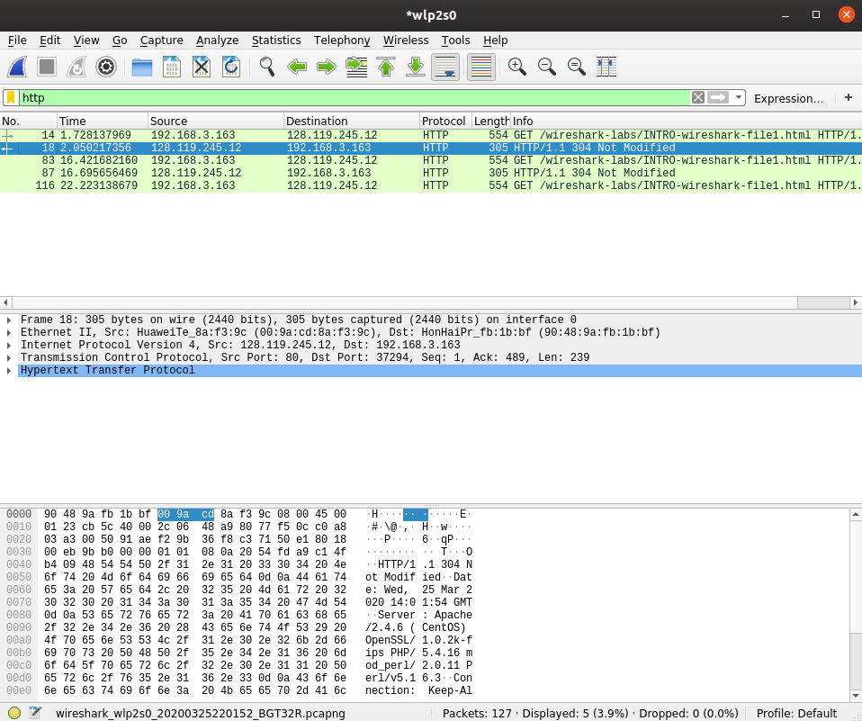
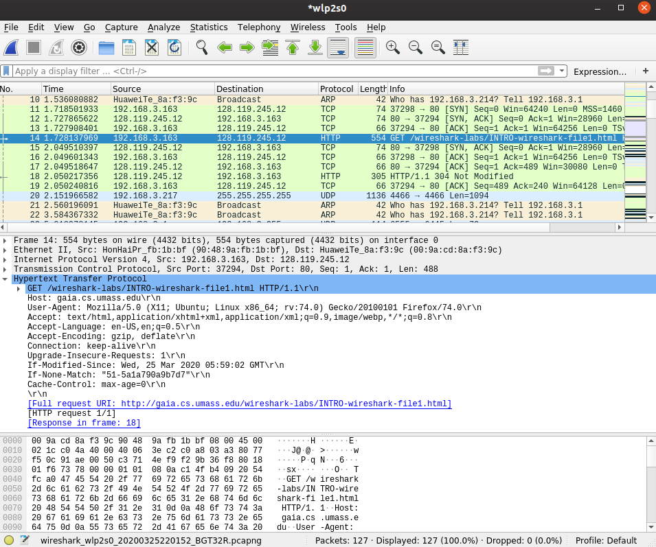

# Wireshark Lab: Getting Started

Copyright (c) 2020 Minaduki Shigure.  
南京大学 电子科学与工程学院 吴康正 171180571

## 实验环境

Ubuntu 19.10 eoan w/ x86_64 Linux 5.3.0-40-generic  
Broadcom BCM4352 Wireless Network Adapter  
Wireshark Version 3.0.5 (Git v3.0.5 packaged as 3.0.5-1)

## 实验内容：你好，世界！

1. 首先运行Wireshark，从原则上来说，不应该允许任何非root用户拥有抓包的权限，因此切换到超级用户，然后再运行程序。  
可以看到启动后的界面如下所示：

2. 启动后的界面列出了电脑上可供监听的端口，选择`wlp2s0`来监听此电脑无线网卡上的所有通讯，可以看见图示中就捕获到了一些不同协议的通讯，比如路由器广播的ARP询问、电脑系统更新时查询服务器DNS的请求等。

3. 按照课本上的要求，访问网页http://gaia.cs.umass.edu/wireshark-labs/INTRO-wireshark-file1.html，在Wireshark中找到了如下和此次请求有关联的封包：

4. 可以看见，本地计算机首先向DNS服务器（在本例中配置为路由器）发送了一个DNS请求，得到了网页服务器的IP地址，然后与远程服务器建立了TCP连接，发送HTTP GET请求，远程服务器收到请求后建立TCP连接将HTTP响应发回本地计算机，完成了网页的访问。  
另外，可以使用Wireshark的过滤器功能筛选出所有的HTTP请求，列出如下：

5. 按照课本要求，找到本地计算机发出的HTTP GET请求，Wireshark对数据包进行了层次化的结构分析，展开HTTP层的内容，就可以看到具体的GET请求内容。


## 小结

对于上面获得的HTTP封包，可以看见由于之前已经访问过这个页面，因此此次访问的请求header中包含了“Modified After”的entry，而网页内容的确没有修改，因此收到的响应是“304 Not Modified”，而不是200，服务器也没有回传网页内容，本地浏览器使用了缓存的网页进行显示。

另外发现，在我的计算机上，在启动Wireshark抓包时，有时会完全无法连接网络，询问同学得知，这似乎是Linux上Wireshark的一个普遍Bug，因此在下面的打印请求部分和以后的实验会更换其他平台完成。

对实验要求问题的解答：

1. List 3 protocols: 比如有ARP、DNS、SSL、HTTP、DHCPv6、ICMPv6、TCP、UDP、SMB2等。
2. How Long: 发送HTTP GET请求的时间戳是1.728137696，接收到返回新消息的时间戳是2.050217356，总共耗时0.32207966秒。
3. IP: 服务器的IP地址为128.119.245.12，本机地址由于存在NAT的关系，只能看见LAN地址为192.168.3.163.
4. *由于要求打印的是OK的响应，而之前实验时没有记录到200 OK，因此这里的请求内容是在更换平台之后重新发出记录的。*  
打印出来的两个请求如下，同时PDF源文件Wireshark-HTTP-Capture1.pdf也在同一目录中提供：

```plain
No.     Time           Source                Destination           Protocol Length Info
    150 2.166290       192.168.3.163         128.119.245.12        HTTP     465    GET /
wireshark-labs/HTTP-wireshark-file1.html HTTP/1.1
Frame 150: 465 bytes on wire (3720 bits), 465 bytes captured (3720 bits) on interface en1, id
0
Ethernet II, Src: HonHaiPr_fb:1b:bf (90:48:9a:fb:1b:bf), Dst: HuaweiTe_8a:f3:9c (00:9a:cd:
8a:f3:9c)
Internet Protocol Version 4, Src: 192.168.3.163, Dst: 128.119.245.12
Transmission Control Protocol, Src Port: 59856, Dst Port: 80, Seq: 1, Ack: 1, Len: 399
Hypertext Transfer Protocol
    GET /wireshark-labs/HTTP-wireshark-file1.html HTTP/1.1\r\n
    Host: gaia.cs.umass.edu\r\n
    Upgrade-Insecure-Requests: 1\r\n
    Accept: text/html,application/xhtml+xml,application/xml;q=0.9,*/*;q=0.8\r\n
    User-Agent: Mozilla/5.0 (Macintosh; Intel Mac OS X 10_14_5) AppleWebKit/605.1.15 (KHTML,
like Gecko) Version/12.1.1 Safari/605.1.15\r\n
    Accept-Language: zh-cn\r\n
    Accept-Encoding: gzip, deflate\r\n
    Connection: keep-alive\r\n
No.
\r\n
[Full request URI: http://gaia.cs.umass.edu/wireshark-labs/HTTP-wireshark-file1.html]
[HTTP request 1/1]
[Response in frame: 168]
    Time           Source                Destination           Protocol Length Info
168 2.404677       128.119.245.12        192.168.3.163         HTTP     552    HTTP/1.1
200 OK  (text/html)
Frame 168: 552 bytes on wire (4416 bits), 552 bytes captured (4416 bits) on interface en1, id
0
Ethernet II, Src: HuaweiTe_8a:f3:9c (00:9a:cd:8a:f3:9c), Dst: HonHaiPr_fb:1b:bf (90:48:9a:fb:
1b:bf)
Internet Protocol Version 4, Src: 128.119.245.12, Dst: 192.168.3.163
Transmission Control Protocol, Src Port: 80, Dst Port: 59856, Seq: 1, Ack: 400, Len: 486
Hypertext Transfer Protocol
    HTTP/1.1 200 OK\r\n
    Date: Thu, 26 Mar 2020 07:00:03 GMT\r\n
    Server: Apache/2.4.6 (CentOS) OpenSSL/1.0.2k-fips PHP/5.4.16 mod_perl/2.0.11 Perl/
v5.16.3\r\n
    Last-Modified: Thu, 26 Mar 2020 05:59:03 GMT\r\n
    ETag: "80-5a1bbae97fe64"\r\n
    Accept-Ranges: bytes\r\n
    Content-Length: 128\r\n
    Keep-Alive: timeout=5, max=100\r\n
    Connection: Keep-Alive\r\n
    Content-Type: text/html; charset=UTF-8\r\n
    \r\n
    [HTTP response 1/1]
    [Time since request: 0.238387000 seconds]
    [Request in frame: 150]
    [Request URI: http://gaia.cs.umass.edu/wireshark-labs/HTTP-wireshark-file1.html]
    File Data: 128 bytes
Line-based text data: text/html (4 lines)
```