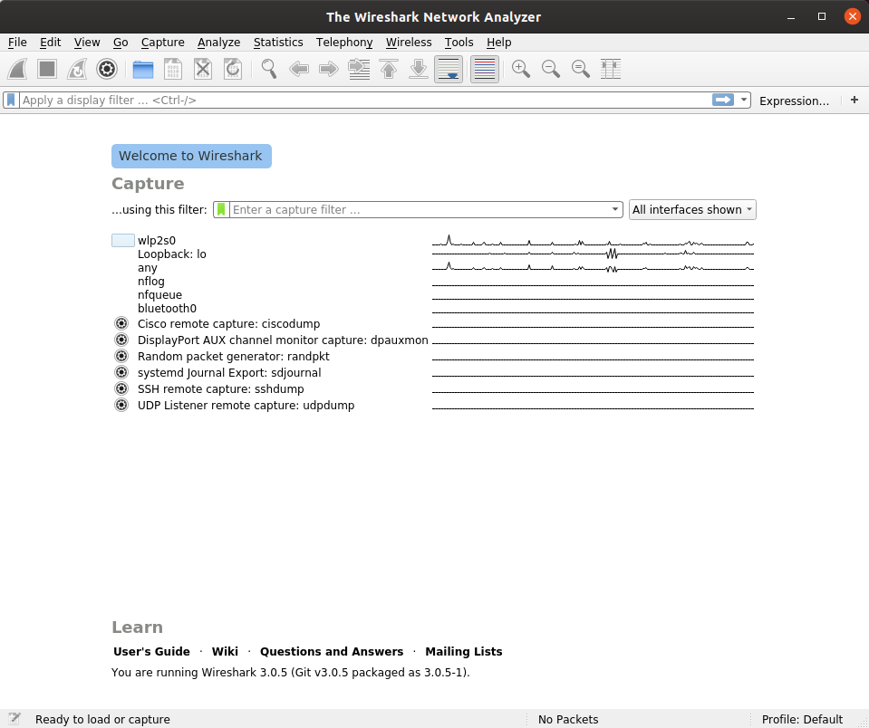
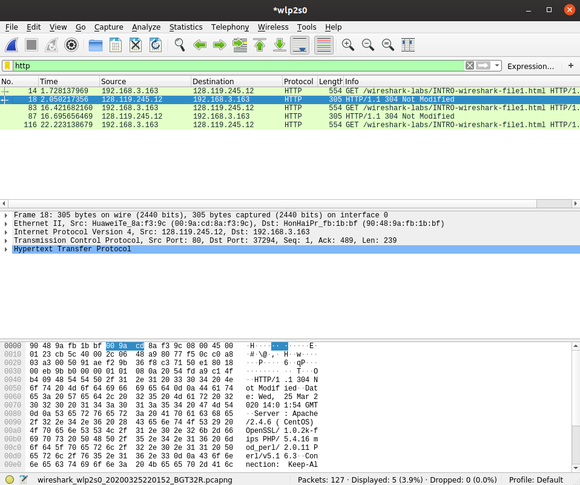

# Wireshark Lab: Getting Started

Copyright (c) 2019 Minaduki Shigure.  
南京大学 电子科学与工程学院 吴康正 171180571

## Lab Environmnet

Ubuntu 19.10 eoan w/ x86_64 Linux 5.3.0-40-generic
Broadcom BCM4352 Wireless Network Adapter
Wireshark Version 3.0.5 (Git v3.0.5 packaged as 3.0.5-1) 

## Lab content: Hello, world!

1. Typically, non-superusers should not be able to capture packets, run wireshark as root.   

2. Multiple interfaces are displayed in this screen, we select `wlp2s0` to start the capture of all communications on the wireless adapter.

3. As the textbook suggests, access http://gaia.cs.umass.edu/wireshark-labs/INTRO-wireshark-file1.html in web browser and find the related packet.

4. As we can see above, wireshark captured all the packets during the HTTP request, along with many other irrelavant packets. Our textbook suggest us to use the filter to list packets using certain protocol. Type `http` and we can see all the HTTP packets.

5. Find the HTTP GET request sent by our computer, wireshark has already analyzed the packet and gave a hierarchical view of the packet.

## Summary

Answers to 