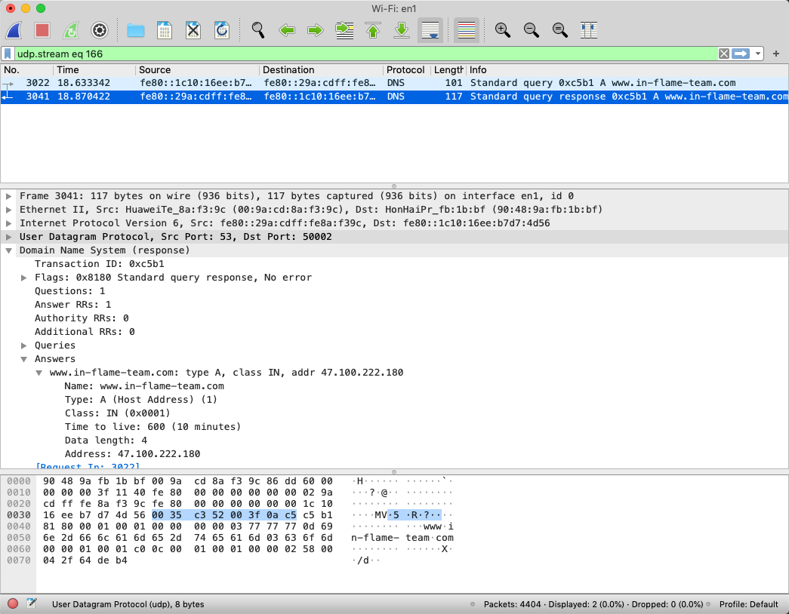
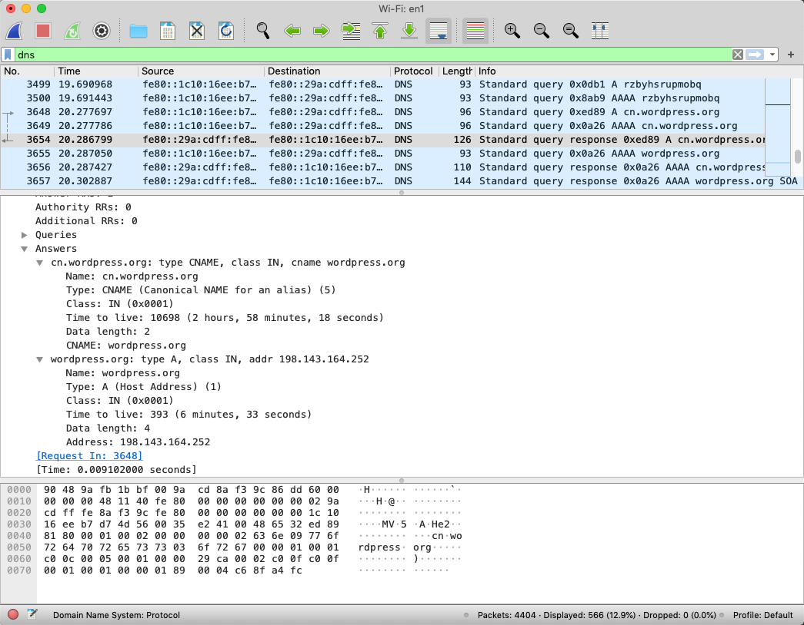
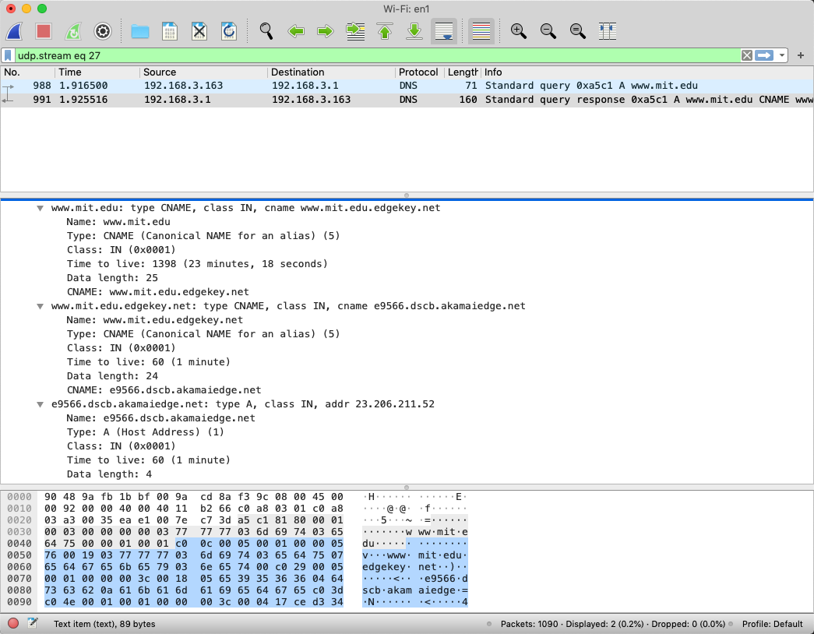
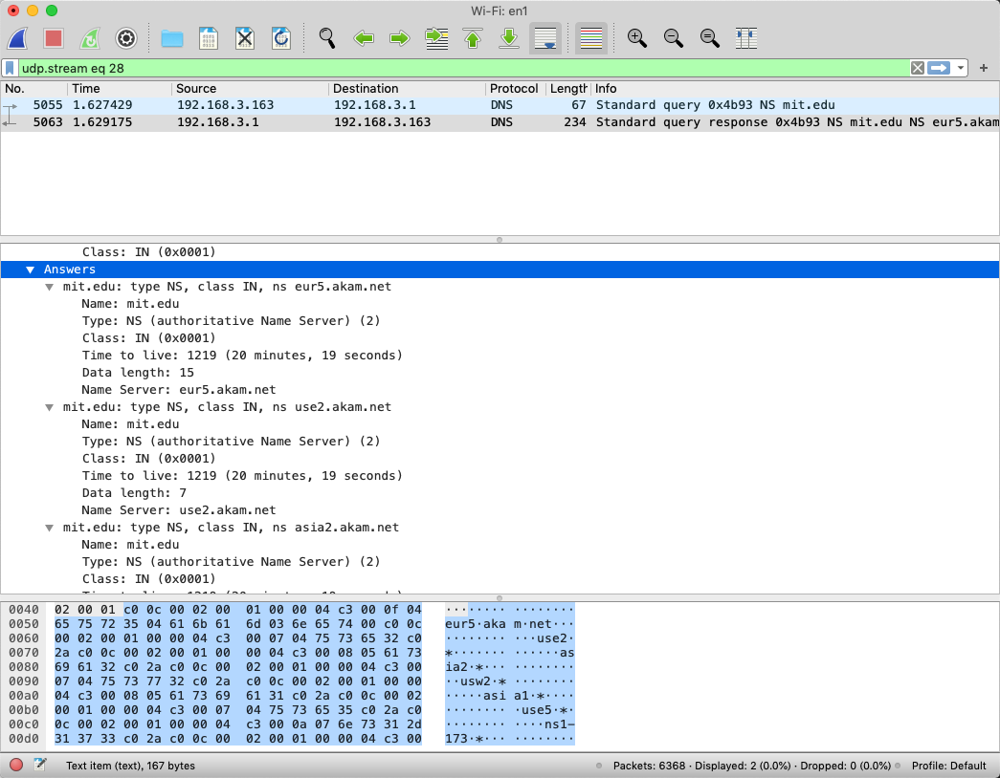
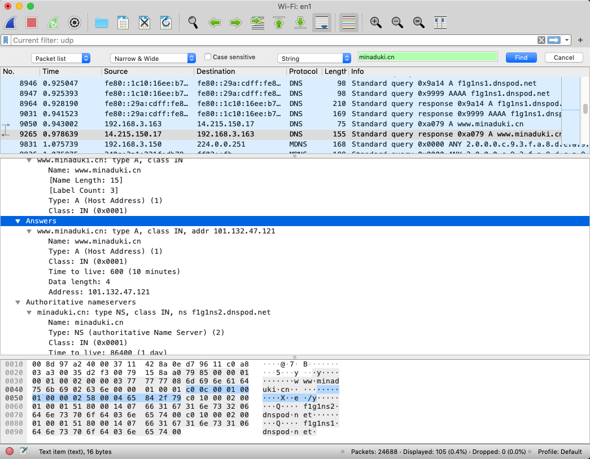

# Wireshark Lab: DNS

Copyright (c) 2020 Minaduki Shigure.  
南京大学 电子科学与工程学院 吴康正 171180571

## 实验环境

macOS “Mojave” 10.14.5  
Broadcom BCM4352 Wireless Network Adapter  
Wireshark Version 3.2.2 (v3.2.2-0-ga3efece3d640)  
Safari Version 12.1.1 (14607.2.6.1.1)

## 实验内容：渐入佳境

1. nslookup命令预热：  
按照指导书上的前两条指令输入，看到的结果如下段所示：  
可以看出，本机的DNS服务器为家里的路由器，同时根据返回的CNAME和NS记录，似乎目标网站现在使用了Akamai的CDN服务，而指导书中提供的DNS服务器已经不再使用了，因此第三句命令会提示连接不到服务器，这里就不再尝试连接，在完成题目时，会使用这句命令进行一部分操作，作为弥补。  

```plain
Minadukis-MacBook-Pro:~ minaduki$ nslookup www.mit.edu
Server:		192.168.3.1
Address:	192.168.3.1#53

Non-authoritative answer:
www.mit.edu	canonical name = www.mit.edu.edgekey.net.
www.mit.edu.edgekey.net	canonical name = e9566.dscb.akamaiedge.net.
Name:	e9566.dscb.akamaiedge.net
Address: 184.30.185.198

Minadukis-MacBook-Pro:~ minaduki$ nslookup -type=NS mit.edu
Server:		192.168.3.1
Address:	192.168.3.1#53

Non-authoritative answer:
mit.edu	nameserver = ns1-173.akam.net.
mit.edu	nameserver = use5.akam.net.
mit.edu	nameserver = asia1.akam.net.
mit.edu	nameserver = asia2.akam.net.
mit.edu	nameserver = use2.akam.net.
mit.edu	nameserver = ns1-37.akam.net.
mit.edu	nameserver = usw2.akam.net.
mit.edu	nameserver = eur5.akam.net.

Authoritative answers can be found from:
```

2. nslookup：

**运行nslookup以获取一个亚洲的Web服务器的IP地址。该服务器的IP地址是什么？**  
由于之前没有使用过指定DNS服务器的方式进行查询，这里在查询时，指定了DNS服务器。  
返回的结果与解析记录地址相符。  

```plain
Minadukis-MacBook-Pro:~ minaduki$ nslookup www.minaduki.cn f1g1ns1.dnspod.net
Server:		f1g1ns1.dnspod.net
Address:	14.215.150.17#53

Name:	www.minaduki.cn
Address: 101.132.47.121
```

**运行nslookup来确定一个欧洲的大学的权威DNS服务器。**  
入乡随俗，还是用自己学校来举例子吧：  
```
Minadukis-MacBook-Pro:~ minaduki$ nslookup -type=NS nju.edu.cn
Server:		192.168.3.1
Address:	192.168.3.1#53

Non-authoritative answer:
nju.edu.cn	nameserver = dns.nju.edu.cn.
nju.edu.cn	nameserver = ns.nju.edu.cn.

Authoritative answers can be found from:
```

*这里和之前一样，显示答案是“非权威的”，这是因为这些记录并非实时获取的，而是来自缓存*

**运行nslookup，使用问题2中一个已获得的DNS服务器，来查询Yahoo!邮箱的邮件服务器。它的IP地址是什么？**  
同样，Yahoo!的邮件服务几乎国内没有人用了，这里改为查询学生邮箱的邮件服务器。  
*学校邮箱由腾讯企业邮箱托管，服务器为exmail.qq.com。*

```plain
Minadukis-MacBook-Pro:~ minaduki$ nslookup mail.smail.nju.edu.cn dns.nju.edu.cn
Server:		dns.nju.edu.cn
Address:	202.119.32.6#53

mail.smail.nju.edu.cn	canonical name = ssl.exmail.qq.com.
```

返回了一个CNAME记录指向腾讯企业邮箱的ssl界面。

3. Wireshark 网页访问DNS  
由于目标网站响应极其缓慢，实验中换用“www.in-flame-team.com“作为目标网站。  
Wireshark返回的抓包结果保存为Wireshark-DNS-Capture1.pdf。

**找到DNS查询和响应消息。它们是否通过UDP或TCP发送？**  
找到的DNS查询和相应信息如下图所示，可以看见，DNS通过UDP协议实现。  

**DNS查询消息的目标端口是什么？ DNS响应消息的源端口是什么？**  
同样根据Wireshark显示的条目可知，DNS查询的目标端口和相应的原端口都是53。  
**DNS查询消息发送到哪个IP地址？使用ipconfig来确定本地DNS服务器的IP地址。这两个IP地址是否相同？**  
DNS查询的信息发送到了`fe80::29a:cdff:fe8a:f39c`，即本地路由器，与ifconfig的查询结果之一相同（还有一个DNS服务器是IPv4的192.168.3.1）。  
**检查DNS查询消息。DNS查询是什么"Type"的？查询消息是否包含任何"answers"？**  
DNS查询信息有两条（针对目标网站），分别是AAAA记录和A记录，查询消息不包括answers。  
**检查DNS响应消息。提供了多少个"answers"？这些答案具体包含什么？**  
对于此目标网站，只提供了一个Answer，即目标网站的IPv4地址，由于我没有设置该网站AAAA记录，所以AAAA查询返回的answer是空的。  
**考虑从您主机发送的后续TCP SYN数据包。 SYN数据包的目的IP地址是否与DNS响应消息中提供的任何IP地址相对应？**  
IP完全对应，同时与设置的A记录内容相符。  
**这个网页包含一些图片。在获取每个图片前，您的主机是否都发出了新的DNS查询？**  
我提供的目标网站基于WordPress搭建，因此有部分图标资源来自WordPress网站，本地计算机为cn.wordpress.org与数个其他的WordPress站点发出了新的DNS查询并收到了返回的结果。比如，对cn.wordpress.org的查询返回了一项CNAME记录与CNAME记录内容对应的A记录。  


4. Wireshark nslookup 命令1  
Wireshark返回的抓包结果保存为Wireshark-DNS-Capture2.pdf。  
**DNS查询消息的目标端口是什么？ DNS响应消息的源端口是什么？**  
端口均为53。  
**DNS查询消息的目标IP地址是什么？这是你的默认本地DNS服务器的IP地址吗？**  
目标IP为192.168.3.1，即本地路由器，与ifconfig的查询结果之一相同。  
**检查DNS查询消息。DNS查询是什么"Type"的？查询消息是否包含任何"answers"？**  
仅发送了一条A记录的查询，查询消息不包含answers。  
**检查DNS响应消息。提供了多少个"answers"？这些答案包含什么？**  
提供了两个CNAME和一个A记录，如下图所示，各个条目的作用推测如下：
www.mit.edu的CNAME条目对应的www.mit.edu.edgekey.net为MIT边缘网络的管理节点对应的主页的网站服务器的记录，而www.mit.edu.edgekey.net的CNAME内容e9566.dscb.akamaiedge.net则是网站的CDN提供商提供的对应于网站内容和负责本地计算机对应地区内容分发的CDN服务器地址，其A记录则为它的IPv4地址。  
**提供屏幕截图。**  


4. Wireshark nslookup 命令2  
Wireshark返回的抓包结果保存为Wireshark-DNS-Capture3.pdf。  
**DNS查询消息的目标IP地址是什么？这是你的默认本地DNS服务器的IP地址吗？**  
目标IP为192.168.3.1，即本地路由器，与ifconfig的查询结果之一相同。  
**检查DNS查询消息。DNS查询是什么"Type"的？查询消息是否包含任何"answers"？**  
仅发送了一条NS记录的查询，查询消息不包含answers。  
**检查DNS响应消息。响应消息提供的MIT域名服务器是什么？此响应消息还提供了MIT域名服务器的IP地址吗？**  
提供了数个NS的答案，根据域名分析应该是对应了MIT网站使用的Akamai CDN在不同区域的Name Server的域名。这些answer与nslookup返回的结果相同。  
**提供屏幕截图。**  


1. Wireshark nslookup 命令3  
由于指导书中提供的DNS服务器已经不再使用了，因此命令会提示连接不到服务器。这里改为询问f1g1ns1.dnspod.net服务器查询www.minaduki.cn对应的记录。  
Wireshark返回的抓包结果保存为Wireshark-DNS-Capture4.pdf。  
**DNS查询消息的目标IP地址是什么？这是你的默认本地DNS服务器的IP地址吗？**  
查询f1g1ns1.dnspod.net时目标IP为192.168.3.1，即本地路由器，与ifconfig的查询结果之一相同。查询www.minaduki.cn时目标IP为14.215.150.17，即f1g1ns1.dnspod.net对应的IP地址之一。  
**检查DNS查询消息。DNS查询是什么"Type"的？查询消息是否包含任何"answers"？**  
发送了了一条AAAA记录和两条A记录的查询，查询消息不包含answers。  
**检查DNS响应消息。提供了多少个"answers"？这些答案包含什么？**  
对于f1g1ns1.dnspod.net的查询结果，返回了数个A记录，对应着此DNS服务器的数个可用IP地址，对于www.minaduki.cn的查询结果，返回了一条A记录，与解析记录地址相符。  
**提供屏幕截图。**  


## 小结

为什么有的时候DNS服务器的地址为IPv4，有的时候为IPv6？  
我认为这应该是由于浏览器会默认先以IPv6的方式访问网站（而现在大多数的浏览器的确如此），因此在DNS服务器中也会倾向于更加先进的IPv6，同时可以看见，浏览器在访问的时候也优先查询了IPv6地址对应的AAAA记录。而对于nslookup工具，其默认只支持IPv4，要通过额外的参数才会开启IPv6支持。而其对于DNS服务器的域名解析有可能不是通过自身实现而是调用的外部工具，因此只有在查询f1g1ns1.dnspod.net对应的记录时才连接了IPv6。
