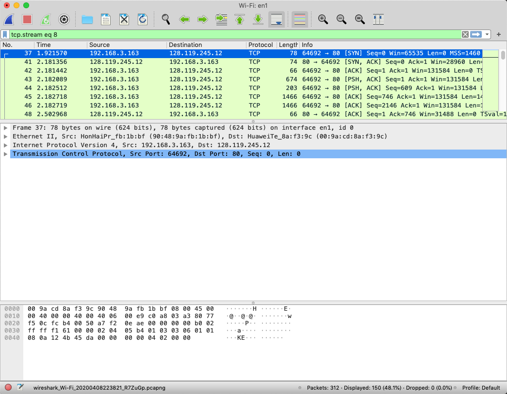
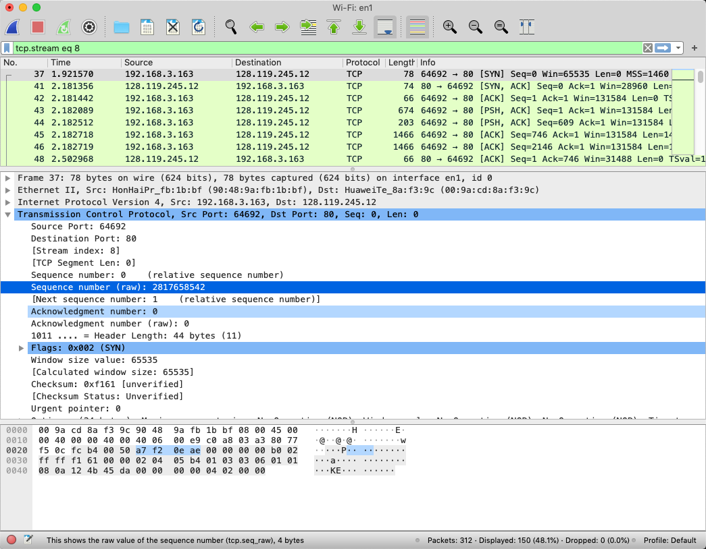
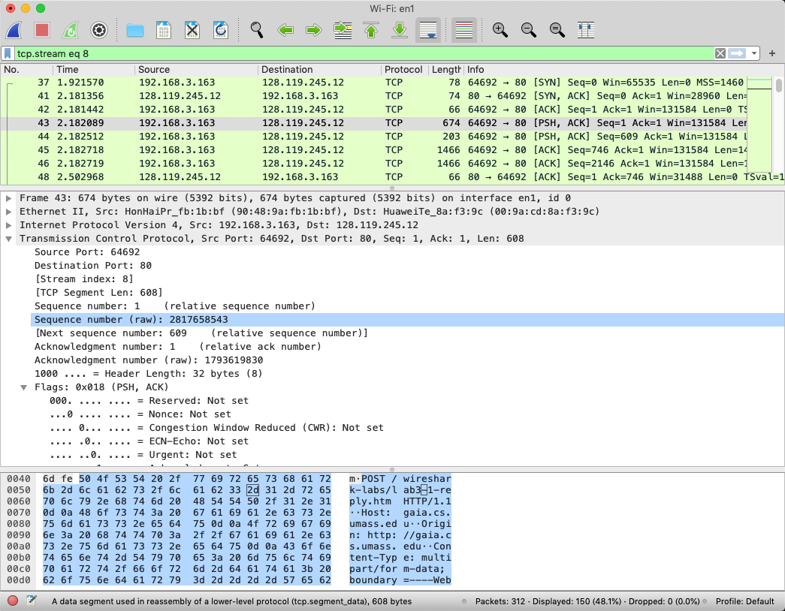
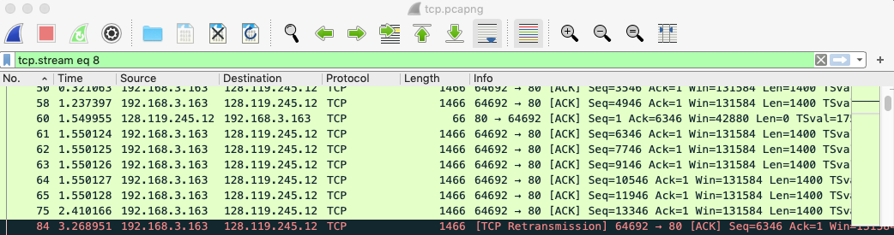

# Wireshark Lab: TCP

Copyright (c) 2020 Minaduki Shigure.  
南京大学 电子科学与工程学院 吴康正 171180571

## 实验环境

macOS “Mojave” 10.14.5  
Broadcom BCM4352 Wireless Network Adapter  
Wireshark Version 3.2.2 (v3.2.2-0-ga3efece3d640)

## 实验内容：握手言欢

按照课本要求，下载文件 http://gaia.cs.umass.edu/wireshark-labs/alice.txt 到本地，然后上传文件并抓包。  
找到起始的SYN包，然后右键选择“跟踪->TCP流”，就能快速列出与这次上传所有有关的数据包，供接下来分析。  
  
**将文件传输到 gaia.cs.umass.edu 的客户端计算机(源)使用的 IP 地址和 TCP 端口号是什么?**  
IP 地址为 192.168.3.163，端口号为 64692。  
**gaia.cs.umass.edu 的 IP 地址是什么? 在哪个端口号上发送和接收此连接的 TCP 段?**  
gaia.cs.umass.edu 的 IP 地址为 128.119.245.12，端口为 80。  
**用于在客户端计算机和 gaia.cs.umass.edu 之间启动 TCP 连接的 TCP SYN 区段的序列号是什么? 将区段标识为 SYN 段的段有什么功能?**  
由下面的截图可以看出，原生序列号为 2817658542。SYN 标识代表此段为一个开始 TCP 连接的请求。  
  
**gaia.cs.umass.edu 发送给客户端计算机以回复 SYN 的 SYNACK 区段的序列号是多少? SYNACK 区段中的 Acknowledgment 栏位的值是多少?**  
同理可以得到，SYNACK 段的序列号为 1793619829。Acknowledgment 位的值为 1。  
**包含 HTTP POST 命令的 TCP 段的序列号是多少?**  
根据具体包段内容，包含 HTTP POST 命令的 TCP 段的序列号是 2817658543。  
  
**将包含 HTTP POST 的 TCP 区段视为 TCP 连接中的第一个区段。在这个 TCP 连线中前六个 TCP 区段的序列号是什么(包括包含 HTTP POST 的段)? 每区段发送的时间是什么时候? 收到的每个区段的 ACK 是什么时候? 鉴于发送每个 TCP 区段的时间与收到确认的时间之间的差异，六个区段中每个区段的 RTT 值是多少? 收到每个 ACK 后，Estimated RTT 值是什么? 假设第一个 Estimated RTT 的值等于第一个区段的测量 RTT，然后使用课本的 Estimated RTT 公式计算所有后续区段。前六个 TCP 区段的长度是多少?**  
根据时间顺序进行排序，以 Wireshark 中提供的“下一个序列号”作为辅助，可以很轻松的定位出前六个 TCP 段，另外，也可以使用追踪 TCP 流的方式完成定位。在时间的问题上，使用包含 HTTP POST 的 TCP 段的时间作为参考零点。

序列号 | 发送时间 | ACK 时间 | RTT | Estimated RTT | 长度
-: | -: | -: | -: | -: | -:
2817658543 | 0 | 未收到 | 未知 | 未知 | 674
2817659151 | 0.000423 | 0.320879 | 0.320456 | 0.320456 | 203
2817659288 | 0.000629 | 未收到 | 未知 | 0.320456 | 1466
2817660688 | 0.000630 | 未收到 | 未知 | 0.320456 | 1466
2817662088 | 0.321063 | 未收到 | 未知 | 0.320456 | 1466
2817663488 | 1.237397 | 1.549955 | 0.312448 | 0.319455 | 1466

**对于整个过程，收到的最小可用缓冲区空间量是多少? 缺少接收器缓冲区空间是否会限制发送方传送 TCP 区段?**  
对于本机，没有经历最小可用缓冲区空间，窗口大小均为 131584。  
对于远端计算机，经历过的最小可用缓冲区空间为 28960，出现在第 41 帧。  
理论上说，如果接收方的缓冲区空间用尽，则会进入等待问询，发送方将暂时停止继续发送，不过在本次实验中，没有出现这种情况。  
**在跟踪文件中是否有重传的区段? 为了回答这个问题，您检查了什么?**  
由于 Wireshark 的高亮机制，可以看出重传的帧被使用黑红色标记了出来，此TCP流中存在着重传，第 84 帧为第 61 帧（对应序列号 2817664888）的重传。  
  
**接收器通常在 ACK 中确认多少数据? 您是否可以识别接收方每隔一个接收到的区段才发送确认的情况?**  

**TCP 连接的吞吐量(每单位时间传输的􏰁节数)是多少? 解释你如何计算这个值。**  

3. 按照课本上的要求，访问网页http://gaia.cs.umass.edu/wireshark-labs/INTRO-wireshark-file1.html，在Wireshark中找到了如下和此次请求有关联的封包：

4. 可以看见，本地计算机首先向DNS服务器（在本例中配置为路由器）发送了一个DNS请求，得到了网页服务器的IP地址，然后与远程服务器建立了TCP连接，发送HTTP GET请求，远程服务器收到请求后建立TCP连接将HTTP响应发回本地计算机，完成了网页的访问。  
另外，可以使用Wireshark的过滤器功能筛选出所有的HTTP请求，列出如下：

5. 按照课本要求，找到本地计算机发出的HTTP GET请求，Wireshark对数据包进行了层次化的结构分析，展开HTTP层的内容，就可以看到具体的GET请求内容。

## 小结

对于上面获得的HTTP封包，可以看见由于之前已经访问过这个页面，因此此次访问的请求header中包含了“Modified After”的entry，而网页内容的确没有修改，因此收到的响应是“304 Not Modified”，而不是200，服务器也没有回传网页内容，本地浏览器使用了缓存的网页进行显示。

另外发现，在我的计算机上，在启动Wireshark抓包时，有时会完全无法连接网络，询问同学得知，这似乎是Linux上Wireshark的一个普遍Bug，因此在下面的打印请求部分和以后的实验会更换其他平台完成。

对实验要求问题的解答：

1. List 3 protocols: 比如有ARP、DNS、SSL、HTTP、DHCPv6、ICMPv6、TCP、UDP、SMB2等。
2. How Long: 发送HTTP GET请求的时间戳是1.728137696，接收到返回新消息的时间戳是2.050217356，总共耗时0.32207966秒。
3. IP: 服务器的IP地址为128.119.245.12，本机地址由于存在NAT的关系，只能看见LAN地址为192.168.3.163.
4. *由于要求打印的是OK的响应，而之前实验时没有记录到200 OK，因此这里的请求内容是在更换平台之后重新发出记录的。*  
打印出来的两个请求如下，同时PDF源文件也在同一目录中提供：
